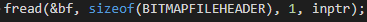

- In a world where everything are 0 and 1 at the end that represent different thing depending of the context where they are, now i know the importance of divide those 0 and 1 and arranged them in better and more understandable ways with the famous [[Data Types/Data Structures]] #computer_science
- Future Johiny if you see something like this this in #C:
	- 
	- this is the fread() function is good idea to read it from right to left like:
	- and save it in this variable <--- of this size <--- read 1 item or structure <--- from this file