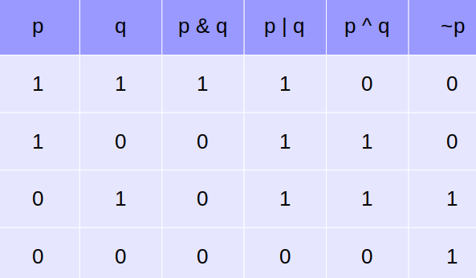

- Tabla Logica de operaciones Bitwise #Python [[Bitwise Python]]
collapsed:: true
	- 
	- el operador extraño de aquí es el operador ^ (xor) que dará 1 (true) solo si exactamente 1 de los 2 valores es 1 (true).