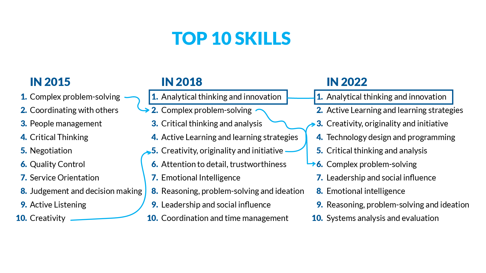
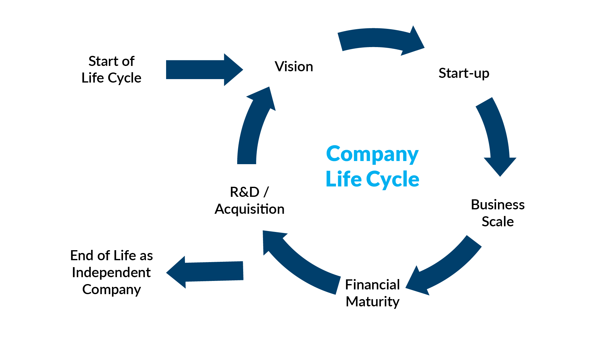

- #Future estancarse en solo una carrera sera catastrófico en el futuro o se podría decir que desde ahora mismo.
- #Future tienes que concentrarte en las habilidades que son las mas difíciles de automatizar ya que ellas son las que te abrirán las mas grande puertas en la próxima revolución, el humano pasara de hacer trabajos repetitivos y fáciles, ha abordar grandes problemas creativos y complejos.
- #Future World Economic Forum skills:
  
- #Job dependiendo de en que momento del ciclo de vida de una empresa estés esta valorara mas ciertas actitudes o habilidades.
  
  por ejemplo en el periodo de vision la innovación y liderazgo serán lo primero, en el start-up la experimentación y aprender a buen ritmo sera lo mejor, en el business scale se vera el con muy buenos ojos las buenas practicas y la comunicación, mientras que en el financial maturity mas buena comunicación y fácil adopción de tecnologías que ya utilice la empresa.