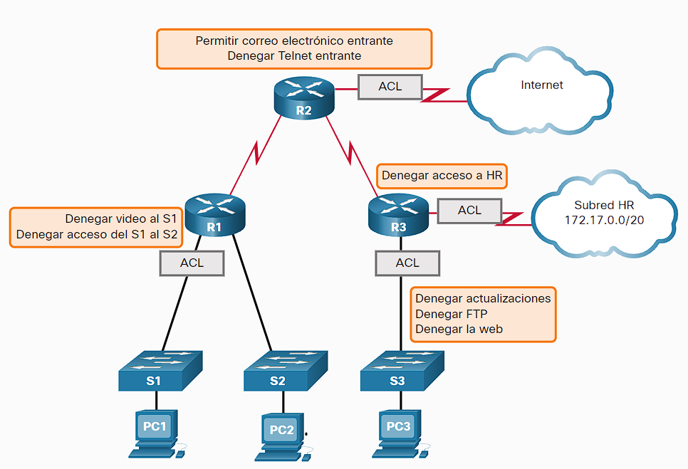

- Access Control List, sistema que descarta paquetes según sus encabezados como por ejemplo:
- bloquear el trafico de un tipo especifico como el trafico de video.
- O restringir a un host a cierta área o servicio/protocolo especifico de la red.
- Clasificar el trafico para dar prioridad a cierto tipos de paquetes.
- permitir solo el trafico [[TCP]] que contenga un conjunto especifico de bits es sus claves de autenticación ACK/RST.
- {:height 623, :width 901}
- Los hay de 2 tipos el estándar que revisa solo el encabezado [[IPV4]] y extendido el cual revisa muchos mas encabezados como lo son:
	- Tipo de protocolo
	- Dirección IPv4 de origen
	- Dirección IPv4 de destino
	- Puertos TCP o UDP de origen
	- Puertos TCP o UDP de destino
	- Información optativa de tipo de protocolo para un control más preciso
- también pueden configurarse para recopilar logs sobre la acciones que toma el ACL