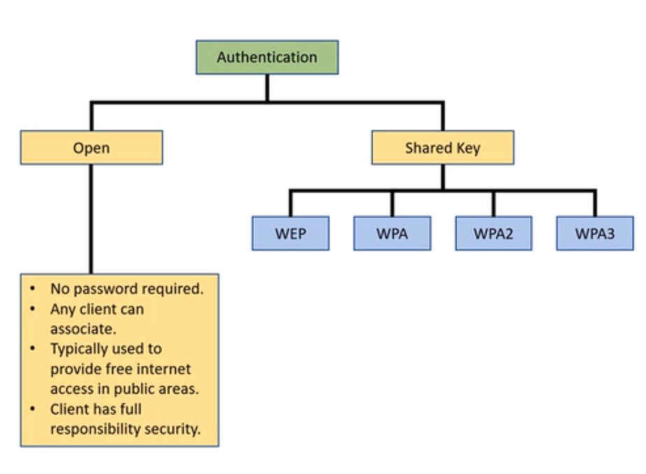
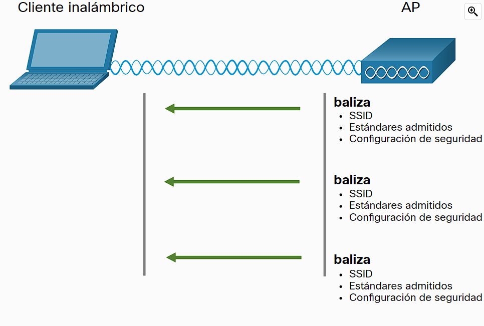
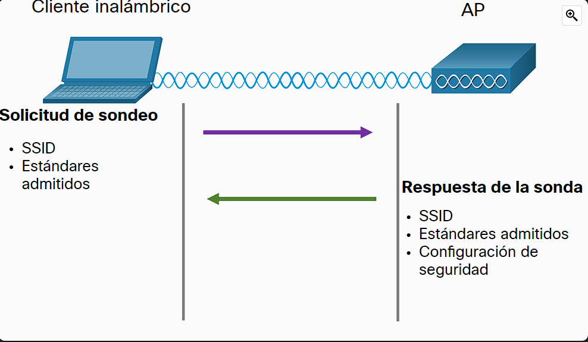

- O Access Point como lo podrás intuir por sus nombre son los puntos donde podemos acceder a una red y de esta a todos los dispositivos que estén conectados, los routers de toda la vida, estos suelen utilizarse en redes inalámbricas veamos sus características y proceso de conexión:
- SSID: nombre o identificación del AP en una red varios AP pueden compartir el mismo SSID
- Contraseña: parámetro opcional dependiendo de la seguridad de la red para lograr autenticar al usuario.
  
- Modo de red: los AP pueden manejar varios estándares al mismo tiempo WLAN 802.11 a/b/g/n/ac/ad, podrías indagar mas sobre esto en el futuro.
- Modo de seguridad: que tecnología de seguridad se esta utilizando como [[WPA2]] etc.
- Configuración de canales: los canales hacen referencia a los canales de radiofrecuencia, si esos cables invisibles que hacen posible la magia, estos podrían chocar si varios clientes están usando los mismos a un punto de acceso u otro cercano, imagina miles de ondas invisibles viajando por el aire y si estas van de frente van a chocar, por ello los AP y clientes pueden escanear y encontrar automáticamente los canales despejados para poder usarlos con tranquilidad o hasta nosotros ajustarlos manualmente.
- Para que la conexión se exitosa el cliente y el AP deben acordar que parámetros y con que valores los van a utilizar.
- Existen 2 modos de que se acuerden estos parámetros y se establezca la conexión.
- Modo pasivo: el AP emite los parámetros necesarios para establecer conexión a todos los dispositivos cercanos en una área limitada.
  
- Modo Activo: El cliente debe tener el SSID del punto de acceso al quiere conectarse y mandar una solicitud para conocer que requisitos son necesarios.
  
- Como todo sistema las WLAN no están libres de vulnerabilidades veámoslas [[Vulnerabilidades WLAN]]