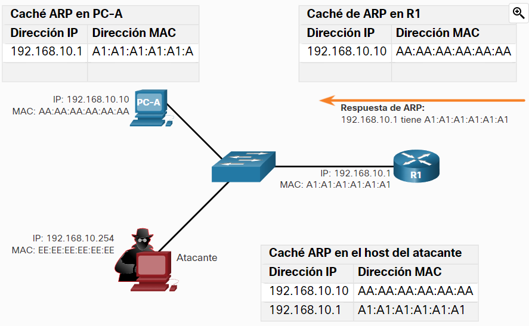
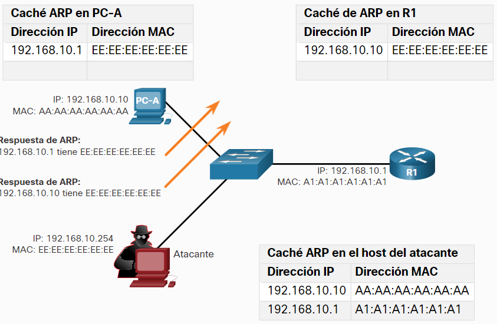

- Una solicitud de ARP se efectúa entre una red para saber que dirección de MAC esta asociada a una [[IP]] especifica, cuando un dispositivo se inicia por primera vez envía este tipo de petición para informar a los demas dispositivos de la red, un atacante podría enviar una petición así para engañar a los otros hosts de la red y hacerse pasar por el router enlazando su dirección MAC con la dirección IP de la puerta de enlace que viene por defecto en la cache ARP.
- Alterar el cache ARP puede ser una manera bastante eficiente de ejecutar un [[MITM Y MITMO]]
  Funcionamiento Normal:
  
- Envenenamiento del cache ARP:
  