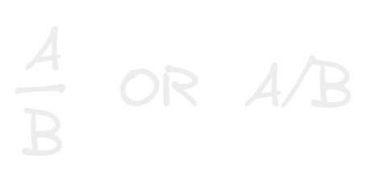
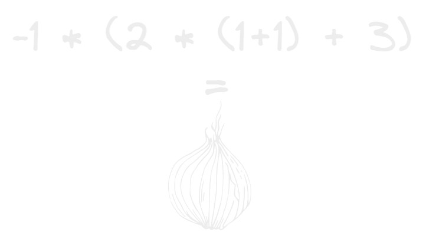
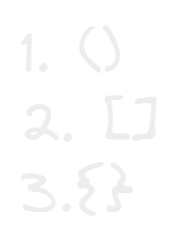

- en algebra hay 2 simbolos fundamentales
- las contantes las cuales mantienen su valor a través del tiempo y el espacio, 2 siempre sera 2 aquí o allá y antes o después
- y las variables las cuales su valor es indefinido y puede varia según el lugar o el tiempo
- por alguna extraña razon las multiplicaciones en algebra se pueden representar con un punto A.B con paréntesis (A)(B) o hasta con un vacío total wtf porque? AB.
- Tambien la division se representa como una fracción o con una slash:
  
- el paréntesis en la aritmética básica funciona como un signo de agrupación el cual su funcionamiento se asemeja al de una cebolla y sus capas donde vas resolviendo las cosas de adentro para afuera:
  
- pero en la algebra los signos de agrupación funcionan un poco distinto ya que aunque siguen una jerarquía las cosas no se resuelven intrínsecamente de adentro para afuera sino, se podría decir que junta expresiones y todas esas expresiones serán afectadas por algo, en vez de resolver de adentro para afuera agarra un trozo de la ecuación y lo que tenga al lado afectara a ese trozo y todas las expresiones que contenga a la vez.
- por ahora la jerarquia principal es:
  
  y ire expandiendo mas como funciona a detalle.
- hay varias[[Leyes Matemáticas]] curiosas que tienen sus bases seguramente en los axiomas y leyes fundamentales de las matemáticas que me encantaría llegar a fondo y comprenderlas pero por ahora tendré que seguirlas.
- ya entendiendo las leyes básicas es hora de entrar en el terreno del [[Lenguaje Algebraico]]