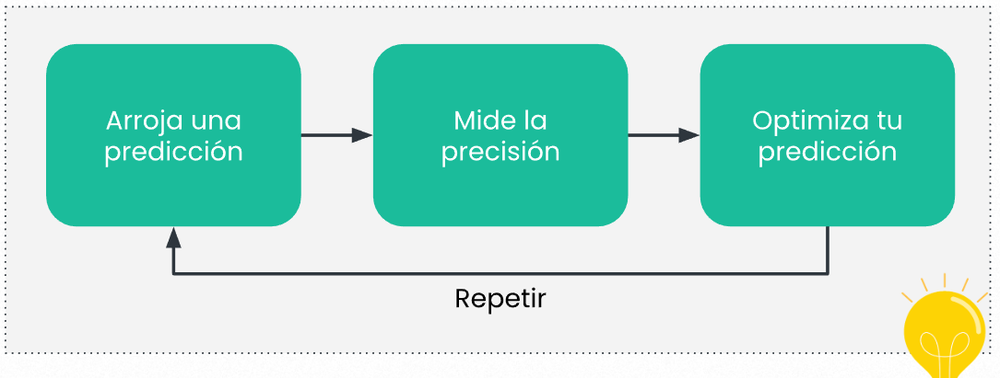

- Este algoritmo se podría resumir en simples pasos.
- 1. Iniciar los pesos y el bias en valores random sin ningún sentido particular
  2. Arrojamos una predicción ingresando algunos datos a nuestra neurona
  3. Medimos la precision de nuestra predicción con lo que esperábamos
  4. Optimizamos nuestro parámetros según lo descubierto en la precision.
  5. Volvemos al paso 2 hasta que la precision sea muy alta.
  
- Como puedes ver no luce muy complicado pero hay llegan las preguntas, como mido la precision?, como optimizo los valores? como se si los pesos necesitan ser incrementados o reducidos?, etc.
- Si la precision no es muy alta pueden ser muchísimos factores, el peso 2 necesita ser se menor o mayor? eso puede deberse a que nos estamos pasando con el peso o nos esta faltando en algún lugar, la precision solo mide que tanto nuestra predicción se parece a la realidad que estábamos esperando, no nos dice donde puede estar el error o desajuste que esta causando ese gap/ brecha entre el valor conseguido y el valor esperado.
- Comencemos a dividir por partes, primero para medir la precisión podríamos mejor medir el error de alguna manera, un algoritmo, formula etc.
- Pero para sacar mas provecho al valor que calculemos el error podríamos volverlo una [[Función Matemática]] para poder utilizar mas técnicas matemáticas avanzadas.
- Al error ser una función podríamos pasar a la fase de [[Optimización de un error]] donde se utiliza [[Calculo Diferencial]] si lo estas escuchando bien ese calculo que solo has escuchado en videos y curriculums de universidad!.