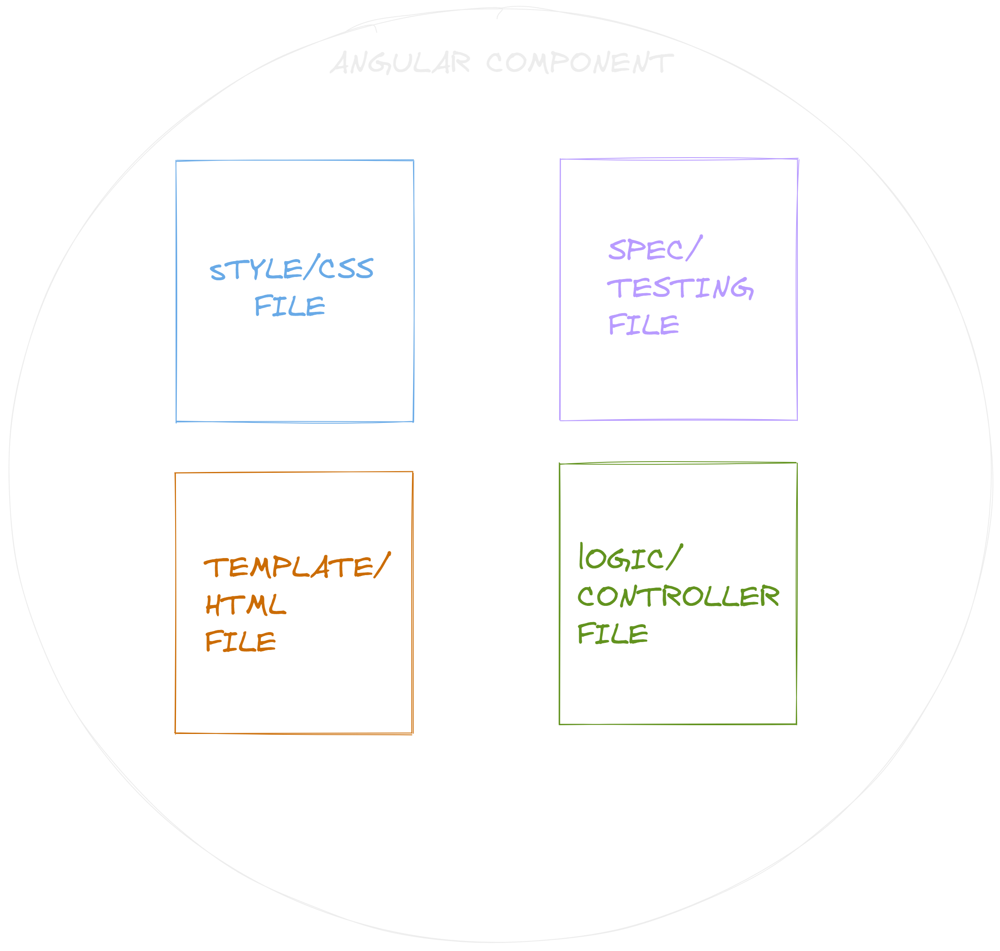

- parece ser que cada componente de angular literal se alinea mas a la palabra componente que en [[React]] ya que literalmente aquí es una carpeta completa con diferentes archivos que componente un pedazo de la app, mientras que en react es una el return de una función lol.
- un componente de angular se compone de:
  
  como ves en la imagen se divide en los 3 grandes pilares del desarrollo web estructura, estilo y programación, además de eso se agrega un cuarto elemento el testing que es muy importante en aplicaciones grandes.
  Literalmente toda la lógica, las variables para guardar información, funciones etc., estarán en el controller del componente.
- Para que las variables/propiedades que declaremos en el controller se puedan usar en el template tienen que ser publicas.
- pero ya que son archivos separados de alguna forma se tienen que comunicar no?
  exacto y ahi entran los diferentes tipos de [[Data Binding]] aquello que une el componente con la plantilla.
- Que son las [[Directivas]] de verdad son tan importantes???! parece ser que si.
- parece ser buena practica capturar primero el target de un elemento y especificar que tipo de elemento html es, ya que como todo angular es typescript, necesitas tener bien definido que es cada cosa hasta un simple elemento html normal del [[DOM]]
- para iterar y devolver varios elementos de html de una sola vez sin ningún tipo de contenedor extra se peude utilizar un ng-container.
- Angular también tiene algo llamado Template variables donde puedes guardar la referencia a un objeto/elemento para luego utilizarlo en alguna otra parte de este template/html.
- ***Angular Template variables*** #code
  ```html
  <input #phone placeholder="phone number" />
  
  <!-- lots of other elements -->
  
  <!-- phone refers to the input element; pass its `value` to an event handler -->
  <button type="button" (click)="callPhone(phone.value)">Call</button>
  ```
- Nos vamos a los [[Angular Forms]]