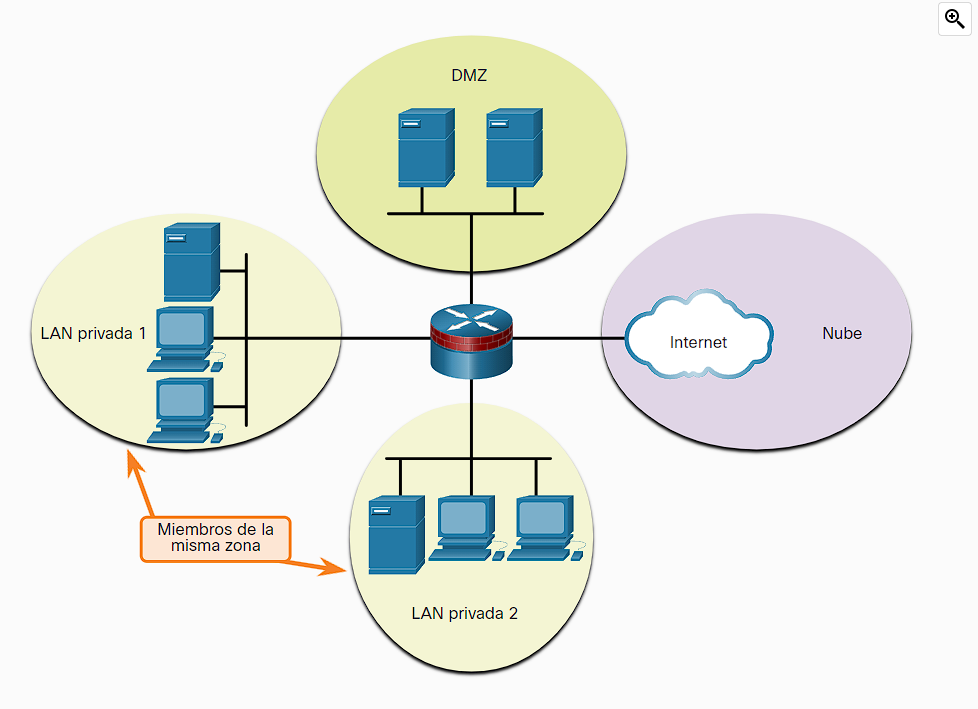

- Privado y Publico: el firewall divide el trafico en 2 categorías trafico de confianza (trafico que proviene de la red interna o esta relacionado con este, como respuestas a peticiones originadas en al red interna)  y trafico que no es de confianza (trafico que proviene de redes externas). Con estas 2 distinciones el firewall puede bloquear o permitir firewall según se configure.
  
- Zona DMZ: se utiliza una [[Zona DMZ]] la cual actúa como intermediario entre al red privada y publica tendrá sus reglas establecidas para dejar o pasar trafico.
  
- Zone-Based firewall: como su nombre lo dice estos basan sus reglas en zonas de confianza.
  