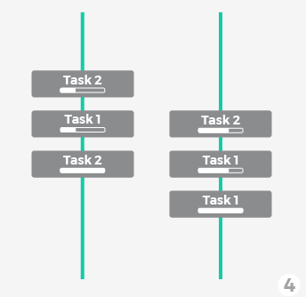
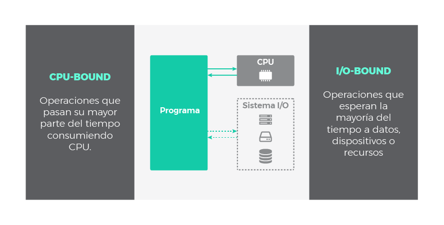
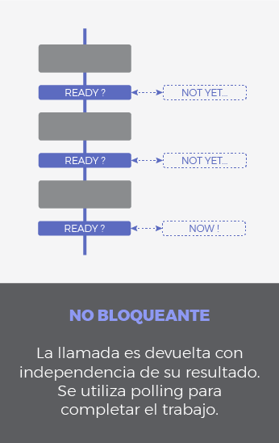
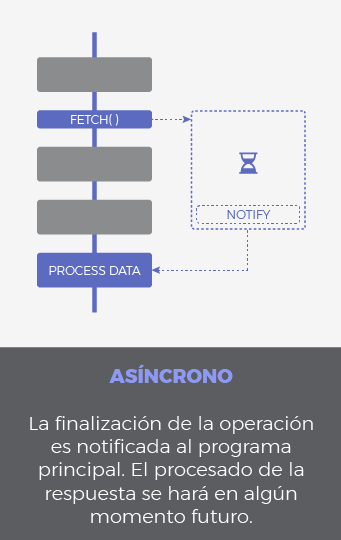

- Para entender la asincronía primero debemos comenzar con una buenas bases de como funcionan los programa a traves del tiempo, al final del día los programas solo son instrucciones una tras otra por lo que en condiciones normales seria una una línea de ensamblaje hasta que no termine algo no sigue la siguiente acción:
  collapsed:: true
	- 
- Pero esto conlleva un gran problema para el resto, si una sola tarea tarda mucho las demás ya podrían estar listas si no tuvieran que esperar a que su compañera termine.
- Para este problema conceptos como el de la concurrencia (Diferentes acciones que progresan simultáneamente ) son muy importantes.
- Con esto en mente se creo una técnica de entrelazado que lo que hizo fue dividir cada tarea en micro tareas e ir completando micro tareas de diferentes tareas para que todas las tareas avancen a la vez:
  collapsed:: true
	- 
- Luego de eso habría una técnica aun mejor que es en vez de que las cosas solo progresen simultáneamente sino también que ocurran al mismo tiempo, para eso se necesitarían multiples rutas por donde el programa pueda procesar información para que las instrucciones que le demos se vayan por diferentes caminos y no solo una línea recta:
  collapsed:: true
	- 
- con eso se desarrollaría el paralelismo con el que varias acciones están pasando a la vez y eso se puede combinar con el entrelazado para que varias cosas estén pasando a la vez de forma entrelazada:
  collapsed:: true
	- 
- Tambien cada acción de un programa tiene un limitante o es mas dependiente de cierto componente físico lo las divide en ciertas categorías:
  collapsed:: true
	- 
	- A las operaciones cpu-bound se le puede aplicar las técnicas mostradas arriba, pero en cuanto a las I/O-bound se les puede aplicar otra técnica de concurrencia llamada asincronía.!
- Una petición a una base de datos se considera una acción de tipo I/O y esta a su vez puede ser de 2 tipos en el contexto del programa:
  collapsed:: true
	-  
- y de otros 2 tipos en su funcionamiento interior:
  collapsed:: true
	-  
- Las de tipo síncrono son bloqueantes por naturaleza a menos que se utilize una técnica de concurrencia con lo cual la data se iría consiguiendo poco a poco a trozos, por el contrario con las de tipo asíncrono solo mandarían una señal y esa señal volvería en algún momento del programa confirmando que la data esta lista para que la usemos.
- Pero como hacer un sistema para que nuestro programa sepa que estamos esperando una data que pedimos en algún momento anterior? y que esa data se utilize a penas llegue?
- Hay entra el loop de eventos de JavaScript!
- el cual es una cola extra que recibe los mensajes del exterior y que espera hasta que el call stack este vacío para ahi colocar/llamar las funciones que definamos, lo que queramos hacer con la info podría generar multiples llamadas a diferentes funciones lo que llenaría otra vez el call stack, entonces el loop espera hasta que este vacía de nuevo así que cuando se haya hecho todo el proceso para la data entrante sigue la siguiente.
  collapsed:: true
	- https://images.squarespace-cdn.com/content/v1/56cdb491a3360cdd18de5e16/1517395047540-0143I4P5HH3OH084ZFSO/event_loop_tick_animated_es.gif?format=1000w
- en esto se basa la sincronía en JavaScript pero entonces para definir cada caso de la acción asincrónica tendríamos que pasarle a la función principal al menos 2 callback una que se ejecutara cuando llegue la notificación de que la data llego y otra de error por si llega una notificación de que la data no pudo llegar por alguna razon al event loop.
- con eso en mente entran las promesas que son objetos que representan ese evento que se dará en el futuro al cual se le puede asignar las funciones que queremos que se llamen en cada caso.
- En resumen en vez de pasar las callbacks a la función asíncrona, cuando se ejecuta la función asíncrona devuelve un objeto al cual se le pueden asignar las funciones que queremos que pasen.
- ***Promise Template*** #code
  ```javascript
  const webPromise = fetch(anyURL)
  webPromise.then(resolve_Good_End_Callback(), reject_Error_End_Callback())
  ```
- El método .then de las promesas también devuelve una promesa lo que hace que se pueda encadenar más acciones al resultado de una.
- ***Promise Template Chain*** #code
  ```javascript
  const webPromise = fetch(anyURL)
  webPromise.then(resolve_Good_End_Callback(), reject_Error_End_Callback())
  .then(do_something_with_upwards_result(result), error_in_this_promise())
  ```
- para evitar tener que pasar una callback de error a cada promesa en una cadena se puede utilizar el método .catch para que la función que definamos se llame cuando haya un error en cualquier parte de la cadena.
- ***Promise Template Chain Catch*** #code
  ```javascript
  const webPromise = fetch(anyURL)
  webPromise.then(resolve_Good_End_Callback())
  .then(do_something_with_upwards_result(result))
  .catch(do_this_if_an_error_occur_in_the_chain(error))
  ```