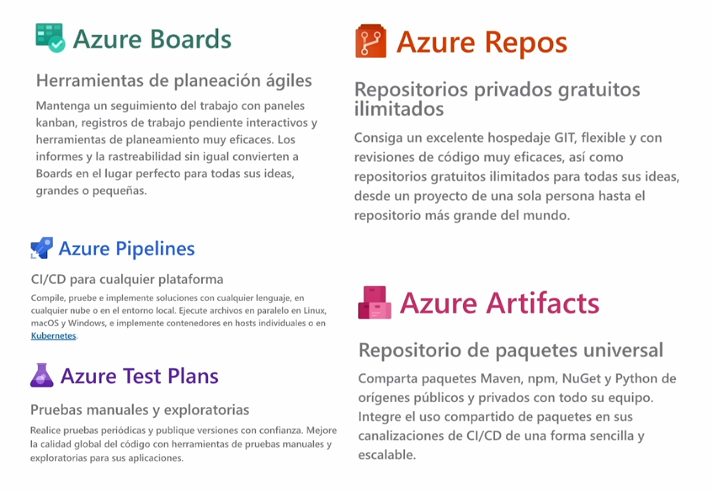

- esta es la suite de DevOps de [[Azure]] casi todas las grandes compañías tecnológicas tienen o están lanzando su propia suite.
- Esta se divide en 5 módulos principales:
  
- todas estas funcionalidades las puedes encontrar en otros servicios:
  azure boards - trello
  azure repos - github
  azure artifacts - private npm
  pero con [[Azure Pipelines]] y [[Azure Test Plans]] las cosas se ponen chidas!
- si no tienes un proyecto de código para empezar a trabajar con DevOps puedes crear un demo con contenido de ejemplo y dummy aqui [Azure DevOps Demo Generator](https://azuredevopsdemogenerator.azurewebsites.net/).