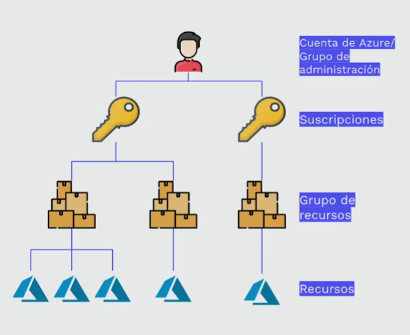

- Cuenta con más de 100 servicios propios y aun más creados por otros usuarios en su Marketplace, cuenta con maneras muy fáciles de conectarse a ella como el portal web o un cli.
- la estructura básica de organización de los servicios de Azure es:
- 
- Los grupos de administración pueden ser anidados lo que conlleva a hacer estructuras mucho mas grandes y complejas. 
  
- Azure cuenta con un grupo de servicios bastante especiales estos son los [[Azure Cognitive Services]]