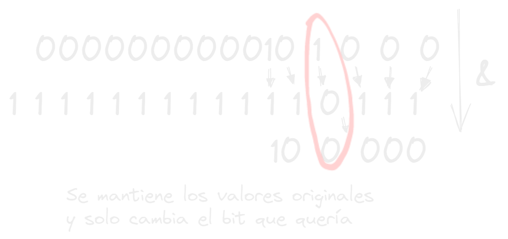

- En el bit masking creas un mascara de bits que ayudara para modificar un solo bit o varios en especifico utilizando los operadores bitwise
- puedes crear una mascara de bits via aritmética con algún tipo de potenciación como (2 ** 8) o con una via posicional moviendo los los bits hacia la izquierda que en resumen es lo mismo (1 << 8)
- Ejemplos de Bit masking
- Que harías para cambiar un bit de un valor en su cuarta posición? #card
collapsed:: true
	- primero crearía una mascara que fuera de unos excepto en la posición del bit que quiero cambiar entonces comprando los bits del valor con los de mi mascara con el operador &, entonces compararía cada pareja de bits y donde haya 2 dejara el 1 como estaba, pero como exactamente en la cuarta posición deje un 0 eso hara que la condición de & no se cumpla y ponga un 0 en vez de un 1.
	- 
- Con las mascaras se puede cambiar el valor de 1 o varios bits, saber si un bit esta en 0 o 1, o hasta saber cuanto valor tiene un bit especifico.