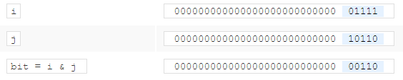
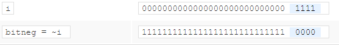

- En las operaciones de Bitwise se comparan cada bit de cada valor directamente con los bits del otro valor
- Podemos decir i = 15, j = 22 y luego al hacer la declaración bit = i & j bit quedara valiendo 6 porque? #card
collapsed:: true
	- literalmente porque esta haciendo la comparación lógica a nivel de bits
	- 
	- esta comprando cada bit con el operador &, entonces las cosas se procesan asi:
	- 0 and 0 = 0
	- 0 and 1 = 0
	- 1 and 1 = 1
	- Con esto solo va a colocar 1 en los bits donde se cumpla la condición de & por eso al final devuelve una cadena de bits que es el numero 6 representado en binario guardado en 32 bits.
- Si digo i = 15 y hago esto bitneg = ~i porque bitneg queda valiendo -16? #card
collapsed:: true
	- Porque se niegan todos los bits del valor que contiene bit, todos los 0 se convierten en 1 y viceversa.
	- 
	- entonces el valor que queda representando la cadena de bits es el del -16
- Los operadores Bitwise también se pueden usar de forma abreviada (x = x & y / x &= y )
- estas operaciones están ligadas al [[Bit Masking]]