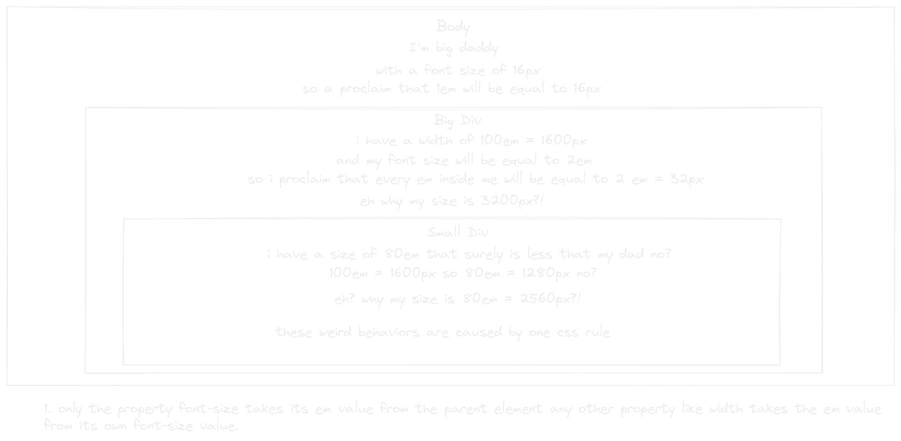
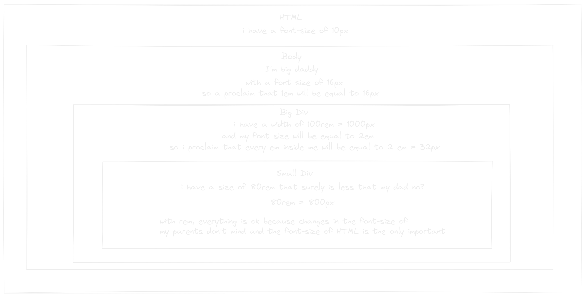

- the percentage % unit need the percentage of something buy what is that something?
  that is its parent so you always are taking a % of the parent element your are in. body literally take the 100% of the viewport/window.
- em is a weird but very interesting unit with it you can manage the size of your elements in relation with the size of its parent font size, what? 1 em will be always the font-size that have its parent.
- the default font-size of body is 16px so if you create a div and give a width of 20em to it, it will be 320px width.
- em unit has a very dangerous behavior compounding effect what this mean?
   
  in this example the big div duplicate the value of an em defining its font-size to be 2em, and this can happen infinitely so in more depth children em could get monstrous values! and cause weird behaviors.
- with this in mind the unit rem come the rescue that is literally em without this problems, it is simple root em it em takes its value from a root element and don't change it, don't mind how deep we are in the html tree. By default it takes its value from the html element who is higher than body.
  