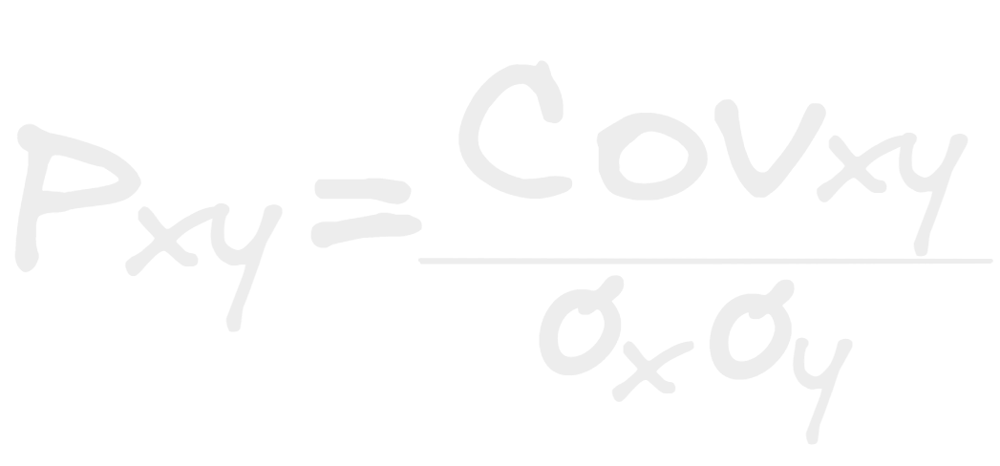

- La formula para hallar el coeficiente de relación es:
- 
- Donde se divide la covarianza de dos variables por el producto de la desviaciones estándar de estas mismas.
- El resultado de esta siempre dará un numero ente 1 y -1 lo que podemos interpretar como un porcentaje de que tanto están relacionadas tanto de forma positiva como de forma negativa.
- si esta es negativa sabemos que las variables van en direcciones opuestas de forma proporcional si una sube la otra baja y viceversa.
- si esta es positiva sabemos que van en la misma dirección entonces si una sube o baja la otra igual.
- si esta esta cercana a 0 entonces podemos decir que no hay correlación negativa o positiva.
- Imagina para saber la correlación entré cada pareja variables tendríamos que calcular esto para cada una, por suerte alguien ya ideo maneras de visualizar las correlaciones mas fácilmente. y esta es la [[Matriz de covarianza]]