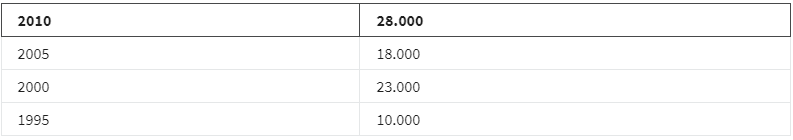
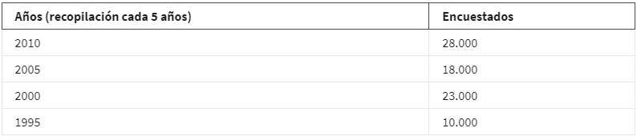

- Aquello que esta alrededor de lo que te estas enfocando, es sencillamente en lo que existe algo.
- Y esto no se queda atrás con los datos.
- Mira esta tabla:
  
- Tienes datos muy bien, ahora ya puedes resolver comenzar a resolver el problema!, cual problema? que significan estos datos?
- Agreguemos un poco de contexto:
  
- ahora podemos tener mas idea de que son estos datos, aunque aun falta mucho contexto.