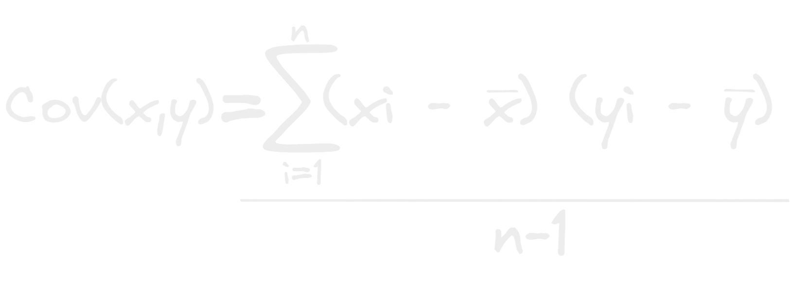

- La covarianza se parece mucho al [[Coeficiente de correlación]] en su funcionamiento ya que mide la relación entre 2 variables pero y esta puede resultar tanto en positiva como negativa pero tiene un problema y es que si los valores que pueden tener esas variables son muy dispares el resultado que obtenemos puede estar muy segado para el lado negativo o positivo.
- 
- Esta se calcula a partir de dividir entre el numero de elementos menos 1 la sumatoria de los productos de las restas de cada dato menos su [[Promedio]] de cada variable.