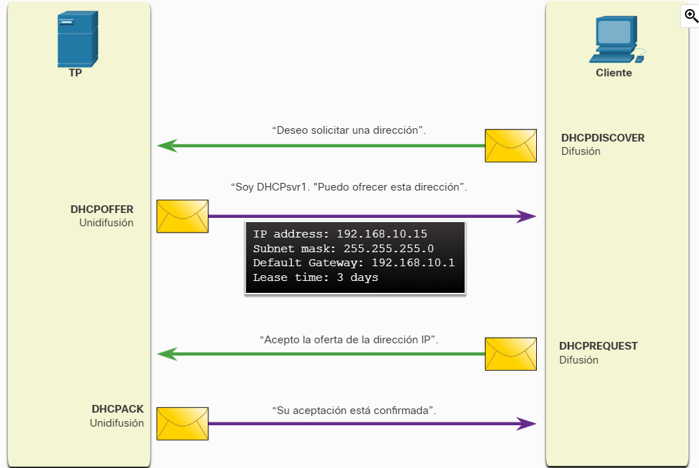

- Protocolo de Configuración Dinámica de Host, es un protocolo que se encarga de asignar una [[IP]] y otras configuraciones de red a cada dispositivo de una red local, este actúa como un servidor par automatizar la administración de la red y no tener que configurar cada dispositivo que se conecta a la red manualmente.
- El funcionamiento normal de un DHPC se ve así:
  
- Bueno este sistema es bastante importante ya que le da mucha informacion a los dispositivos sobre cual va a ser su [[IP]], a donde se van a conectar para conectarse con otras redes y demas entonces imagínate si alguien toma control o suplanta al servidor DHCP?! ahí suceden los ataques [[Ataques DHCP]]