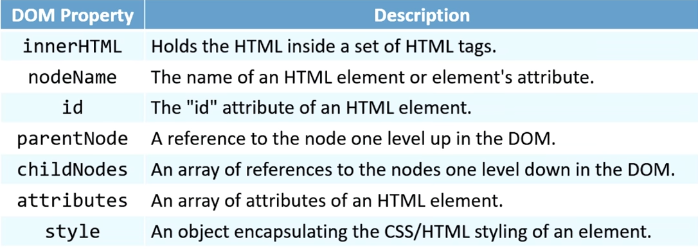
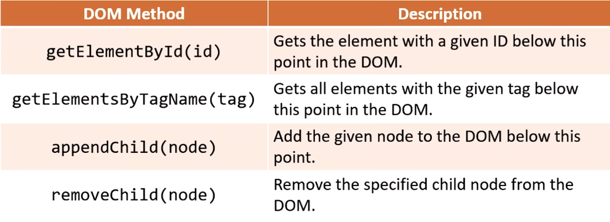

- Document object model or simply the pure HTML-CSS structure that is loaded in the browser after a request.
- lets see! what exactly is the DOM
- [[JavaScript]] has a lot on objects and an special one is named the document object that is the one that contain the whole content written in html of a web page inside of it.
- DOM common properties and methods.
	- 
	- 
- so jQuery is a JavaScript library to make DOM manipulation easier.