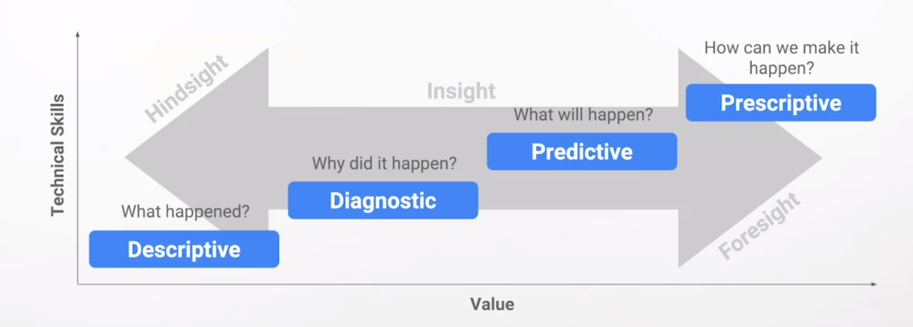

- Aqui estamos viendo mas a profundidad el análisis de datos después de comenzar primero por la data science, te gusta hacer las cosas al revés no?
- Antes de comenzar con la aparte técnica voy a dejar esta sección por aqui [[Conseguir trabajo como Data Analist]]
- Se podría decir que muchas cosas del mundo son data y que cualquier cosa puede generar aun más, hacer una simple observación sobre algo de la realidad ya estaría generando nueva data sobre ello y así sucede con todo lo que nos rodea cada día, en resumen el análisis de datos se compone de la recolección, transformación e interpretación de los datos, para hallar conocimiento, patrones, correlaciones, predecir el futuro, si entiendes los datos estos datos pueden revelarte cosas extraordinarias.
- como todo tema y disciplina este tiene ramificaciones las cuales vamos a ver:
- [[Descriptive Analytics]][[Predictive Analytics]][[Diagnostic Analytics]][[Prescriptive Analytics]]
- Aunque hay diferentes ramificaciones cada una con su seria de pasos y estructura, hay una bastante común la [[PPPACA]]
- en el análisis de datos te encontraras con ecosistemas de datos, los cuales no son mas que los datos, software, herramientas, almacenamiento, personas todo lo que interactúe entre si con la pregunta que quieres responder.
- confiar y sacar todo el provecho de un [[Data Ecosystem]] es muy importante ya que aunque tengas habilidades de estadística y analítica prodigiosas, en algún momento encontraras una laguna, unos conclusiones a las que no le ves sentido, y ahí un experto en el área puede verlo y decir ah claro esto es así porque..., entonces todo hará click en tu cabeza y estarás utilizando todo el poder de que el data analysis puede dar!
- uno de los usos de la data mas simples pero a la vez mas poderosos es el [[Data-driven decision-making]]
- [[Data Analist = Detective?]]
- [[Data Analysis Techniques]]
- Los datos tienen un [[Data Life Cycle]] este hace referencia a como se deben gestionar los datos con los que se trabajara en el análisis.
- Ahora se viene una de las cosas mas chidas, que utilizan los analistas de datos parta hacer todo esto? [[Data Analysis Tools]]
- Los analistas de datos se encuentran con problemas bastante variados en cada proyecto pero ahí algunos que son muy comunes [[Common Data Analysis Problems]]
- En el mundo del análisis de datos podríamos llamar a los datos [[Numéricos]] como cuantitativos/quantitative y los [[Categóricos]] como cualitativos/ qualitative debido a esto los datos cuantitativos suelen mostrar el qué, y los datos cualitativos suelen mostrar el por qué.
- a través del tiempo podrás encontrarte con 2 diferentes tipos de datos según su tamaña los [[MicroDatos/MacroDatos]]
- Una mirada general de todas las preguntas que puedes responder haciendo uso de la data la puedes ver en este asombroso grafico:
  
- Bueno muchas cosas técnicas si muy bien, pero recuerda que no lo es todo y menos ahora en un mundo con una super AI al alcance de nuestra mano por esa razón las [[Habilidades Blandas]] son muy importantes en la actualidad y aun mas en el futuro.