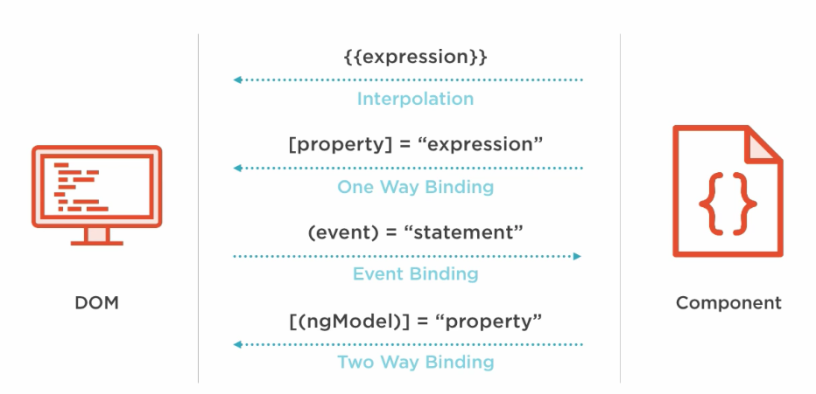

- hay varias maneras de hacer un data binding  en angular las principales son.
  
- como veras una bastante peculiar es el event binding que donde podemos atar un evento del [[DOM]] a una función de nuestro controlador.
- y una aun más extraña es el [[ngModel]] que literal es la fusion entre el property binding y el event binding si lo miras bien.