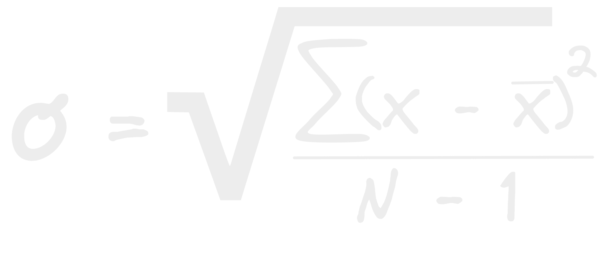

- Se podría decir que la deviación estándar es el promedio de las distancias de todos los datos al [[Promedio]] del conjunto / variable.
- Para conseguir este estadístico primero necesitaremos conseguir otro la [[Varianza]].
- {:height 334, :width 776}