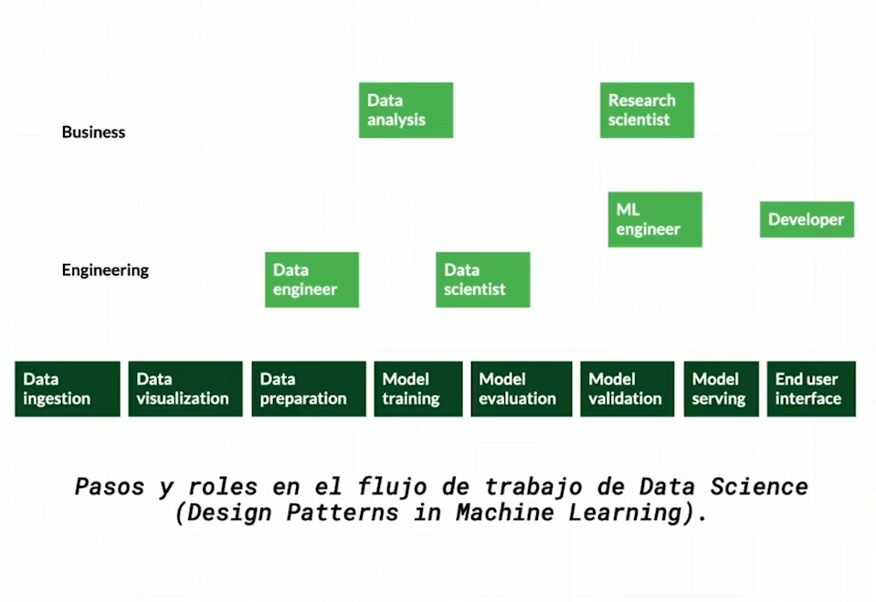

- La estadística es sinónimo de resumir información y resumir es igual a no tener toda la información por lo tanto se perderá información y por lo tanto te puedes haber saltado datos más o menos importantes pero lo crucial es que nunca sera el absoluto o la verdad universal de algo y por eso esta puede ser tan subjetiva.
- Aunque veas los datos, y tú interpretación te parezca un hecho, puede que no veas que otro factor también esta involucrado o hasta que no haya la suficiente información para afirmar lo que estás diciendo, de eso se trata la estadística no porque haya más fruta disponible en la tienda significa que hay más árboles de fruta?
- De dónde viene la fruta?
- La cantidad de fruta varía según que factores?
- Lo importante más que hacer afirmaciones es hacerte buenas preguntas.
- Al parecer existen 2 tipos de Estadística [[Descriptiva]] e [[Inferencial]]
- En el mundo real una sola persona no se encarga de todo el proceso que conlleva la [[Data Science]].
  
  como ves en este diagrama muchos roles se ven involucrados en distintas fases de un proyecto de ciencia de datos.