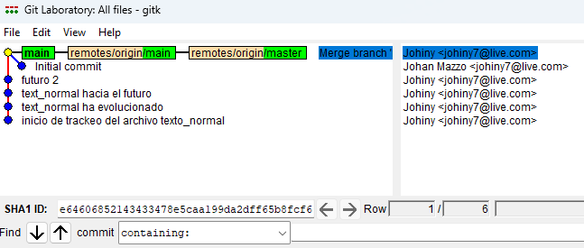

- El sistema de control de versiones mas popular.
- Buena grafica para entender las diferentes áreas/etapas y cual de estas afectan los comandos al trabajar con git:
  
- Buena grafica de como se llega a utilizar las [[Branches]] es un ambiente profesional cotidiano:
  
- la cabecera o Head es como un puntero que apunta sobre que commit esta ahora mismo activo en nuestro directorio, además cuando hacemos checkout a una rama esto nos lleva al ultimo commit de esta por defecto!, por eso el checkout funcionaba con commits o ramas, ahora entiendo que la cabecera no es:
- la versión mas actual de los archivos, o el ultimo commit del master, el head es el puntero que nos indica donde estamos ahora mismo en todo el mar de versiones de nuestros archivos.
- también si alguna vez te habías preguntado como hacían lo de las releases, es con tags en git se pueden agregar tags a cierto commit en especifico y luego esas tags son a las que les ponen el nombre de release v1, v2, v2.4, etc. las tags llevan al commit / código que estaba en algún momento en especifico.
- ***Git Tags*** #code
  ```bash
  git tag -a v1.4 -m "my version 1.4" # add new tag based on where is the head
  git tag -a v1.4 -m "my version 1.4" 9fceb02 # add a new tag based on the commit that is passed as a reference
  ```
- también sabias que git viene con un pequeño software para visualizar las ramas que tengas? se llama gitk muy curioso la verdad.
  
- algo mas avanzado y que en realidad no es de git si no de GitHub son los [[Pull Request]]
- Se pueden tener varios repositorios remotos enlazados con el repositorio local si estamos trabajando con un repo en el cual no somos colaboradores directos, se suele agregar este con el nombre upstream para descargar todas los últimos cambios que hayan hecho los dueños, con eso luego nosotros ya podemos cambiar algunas cosas y subirlo a nuestro repositorio clon/fork.
- El rebase es un comando más avanzado y particular de git, seguramente tendré que utilizarlo y practicarlo más para entender su verdadero significado pero por ahora, es como una especie de merge silencioso con el cual se combinan los commits de 2 branches diferentes para que quede como si todos los cambios se hubieran hecho en una.
- Algunos detalles de esta técnica son:
  1. Hacer rebase primero en la rama que desaparecerá y luego con la que nos vamos a quedar, si no pueden pasar conflictos terribles.
  2. Reescribe la historia del repositorio cambios que se hicieron antes quedaran después, como si se hubieran pegado al final en vez de mezclarlos. 
  3.  Se considera mala practica hacer esto con las ramas del repositorio remoto o ramas compartidas con otros desarrolladores.
- 
- Git stash, un comando muy útil no te ha pasado que has hecho cambios en una rama pero querías hacer eso en otra y no te diste cuenta hasta mucho después?, o hiciste cambios en esa rama pero necesitas mirar algo que esta en otra? entonces quieres cambiar de rama pero para no perder los cambios tienes que agregar y hacer un commit de los cambios, pero no quieres que los cambios queden en esa rama o de esa manera para eso esta git stash al rescate!, se pueden tener varios stash guardados en memoria.
- ***Git Stash*** #code
  ```bash
  git stash #save the current changes in a temp location and return the working directory to the latest branch commit
  git stash pop #recover the asved changes
  git stash drop # delete the current saved changes
  git stash branch new_branch_name #put the current saved changes in a new branch
  git stash list #see all current stashes
  ```
- git clean borra todos los archivos que estén con estado untracked del directorio local, recuerda que todo lo que haya en el archivo gitignore como su nombre lo indica git lo va a ignorar, no va a estar en estado untracked sencillamente para git es como si no existiera.
- Otro comando que no conocía es git cherry-pick, con el puedes traerte un commit especifico de una rama a otra sin tener que hacer merge a toda la rama, si quieres en una rama un cambio especifico que hiciste en otra pero no todo lo que cambiaste porque rompiste algo, o no lo has probado para estar seguro de combinarlo todo, con cherry pick puedes traerte solo algo en especifico, pero al igual que rebase esta considerado como una mala practica ya que modifica la historia del repositorio, si copiaste un commit en especifico y lo pegaste a la rama, cuando hagas el merge de la rama completa te aparecerán los conflictos de los commits duplicados y hasta quedaran commits duplicados en la historia.
- En resumen parece ser que los comandos o acciones que modifiquen el orden de la historia o la historia en si del repositorio, están considerados como malas practicas.
- Que pasa si algo que hacemos un commit, un merge, un rebase cualquier cosa sale mal y el repo entra en caos?
  
  en ese momento entran los [[Comandos de emergencia]] de Git!.
- Sabias que el comando git commit tiene un flag muy útil llamado --amend?
  ***Git Commit --Amend*** #code
  ```bash
  git commit --amend
  ```
- este comando lo que hace es unir nuestros últimos cambios al ultimo commit, si algún momento se nos olvido hacer algo antes de hacer commit, y no queremos hacer otro para un cambio tan pequeño podemos hacer los cambios agregarlos a staging y con este comando meterlos al ultimo y listo.
- Sabias que ya que git tiene todo indexado para trackear los cambios también podemos buscar con el?!
  ***Search With Git*** #code
  ```bash
  git grep "palabra a buscar" #search the word on the current branch files
  git log -S "palabra a buscar" # search in wich commits we use an specific word
  ```
- Si tenemos un proyecto muy grande esto nos puede ayudar a encontrar donde esta un trozo de código específico de nuestro proyecto, o en que commit hicimos ciertos cambios a un componente del proyecto para luego ver que se hizo exactamente en ese commit.
- En git también puedes crear alias para comandos específicos como en [[Linux]], una manera de hacerlo es agregándolos a la configuración global de git con el siguiente comando.
  ***Add Alias to Git Commands*** #code
  ```bash
  git config --global alias.stats "git_command_you_want_to_save"
  ```
- Git tiene un montón mas de comandos que iré recopilando aquí [[Comandos Extras de Git]].