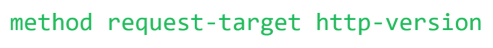

- Is a protocol that tells web browsers and web servers how intercommunicate between them.
- This protocol are very important to know how [[Web Development]] works under the hood.
- template of how looks a simple HTTP request line
	- 
- Existen muchos códigos de estado http para poder saber el estado de la conexión cada uno explica algún caso especifico pero a grandes rasgos estos están divididos en 5 categorías:
- **Categoría 100 (Respuestas informativas)**:
- Estos códigos indican que el servidor ha recibido la solicitud del cliente y puede requerir más tiempo para procesarla. Por ejemplo, el código 100 (Respuesta Continua) señala que el servidor está esperando la solicitud completa.
- **Categoría 200 (Respuestas exitosas)**:
- Los códigos de respuesta 200 y similares indican que la solicitud del cliente se ha procesado con éxito. Por ejemplo, el código 200 señala una solicitud exitosa, el 201 indica que se ha creado un nuevo recurso y el 204 que la solicitud se procesó sin contenido.
- **Categoría 300 (Redirecciones)**:
- Estos códigos se utilizan para redirigir al cliente a una nueva ubicación o recurso. Por ejemplo, el código 301 indica una redirección permanente y el 302 una redirección temporal.
- **Categoría 400 (Errores del cliente)**:
- Los códigos de respuesta en esta categoría indican errores por parte del cliente, como una solicitud incorrecta o falta de permisos. El código 400 indica una solicitud incorrecta, el 401 falta de autorización, el 403 acceso prohibido y el 404 que el recurso no se encuentra.
- **Categoría 500 (Errores del servidor)**:
- Estos códigos señalan problemas en el servidor, como errores internos o sobrecarga. El código 500 indica un error interno del servidor, el 502 una puerta de enlace incorrecta, el 503 un servicio no disponible y el 504 un tiempo de espera agotado.