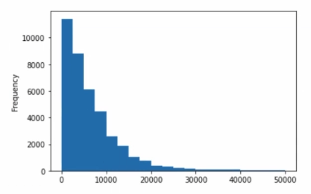

- Un histograma es como una tabla de frecuencia, la unica diferencia es que en vez de que cada barra sea un valor único, cada barra representa un rango de valores y la moda se calcularía a partir de cuantos elementos caen en ese rango para ver cual es el rango o segmento mas frecuente.
- 
- En la grafica de arriba vemos cual es la frecuencia de los precios de autos usados entre diferentes rangos, de 0 a 10.000, de 10.000 a 20.000, etc. y así podemos ver cuales son los valores mas frecuentes trabajando con valores numéricos continuos elementos muy dispares!