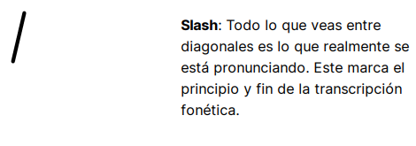
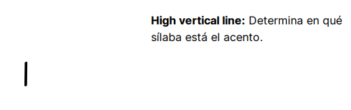
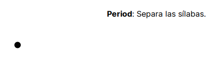
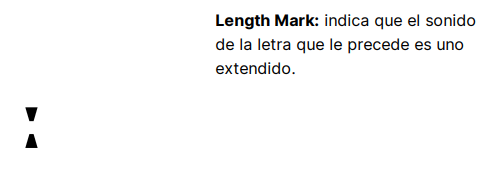

- the international phonetic system.
- unos símbolos de este son:
collapsed:: true
	- Slash:
	  
	  High vertical line / apostrofe:
	  
	  Period (no muy utilizada en la practica):
	  
	  Length mark:
	  
- [[Voiced and Voiceless sounds]] (utilizar o no las cuerdas vocales)
-