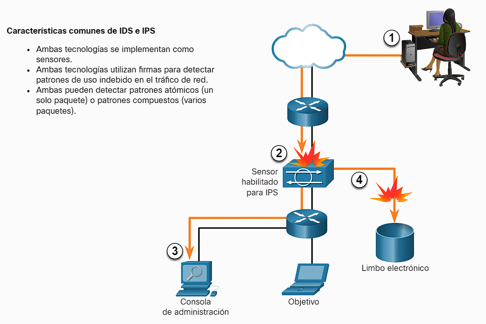
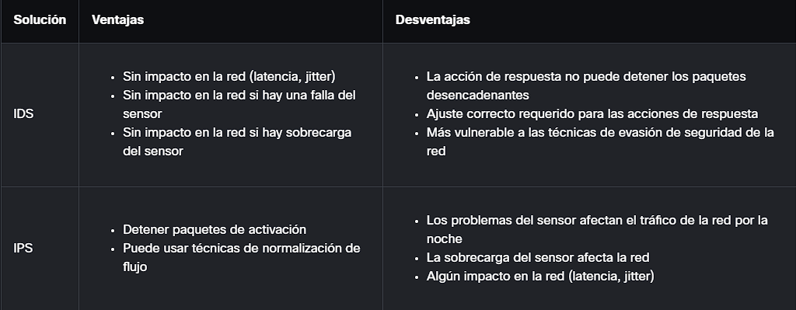

- Cada vez los ataques cibernéticos son mas complejos debido a ello se necesitan sistemas a la par para poder contrarrestar estos ataques aqui entran los IPS/IDS.
- Los sistemas de detección de intrusiones (IDS) y los sistemas de prevención de intrusiones (IPS) son sistemas para detectar e impedir actividades maliciosas hacia una red, estos funcionan a través de vigilar el trafico en los puntos de entra y salida de la red teniendo en cuanta unas [[Firmas De Amenazas]]. Como su nombre te lo podrá indicar uno solo detecta y lanza la alarma mientras el otro tiene capacidades de detener el trafico sospechoso.
  
- Estos pueden existir tanto en forma de [[Software]] como de [[Hardware]] y no son mutuamente excluyentes lo que quiere decir que puedes utilizar ambos al mismo tiempo sin ningún problema.
- Cada una tiene sus ventajes y desventajas especialmente en el impacto que tienen en la red:
  
- Veamos algunos [[Tipos De IPS]]