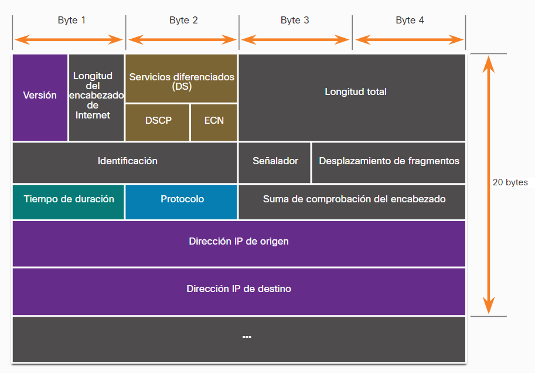

- Es una versión mas actualizada del protocolo [[IP]] el cual agrega varias funciones para mejorar la seguridad de este, como sabrás en los [[Packets]] que viajan a través de  una red no solo viajan los datos que quieres compartir si no también otros datos que se podrían considerar [[Meta Datos]] estos se encuentran en los encabezados de los paquetes.
- Un encabezado de IPV4 viaja con los paquetes en formato binario y suele verse asi:
  
  Todos estos datos pueden ayudar a identificar un paquete malicioso o sospechoso.