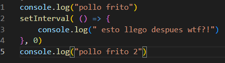
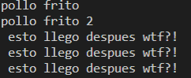

- en JavaScript se pueden usar las funciones antes de declararlas gracias al  [[Hoisting]] que mueve las funciones al principio del [[Scope]] pero solo si son declaradas con function.
- el ecosistema de JavaScript cuenta con 2 principales ambientes donde se puede ejecutar, el navegador/cliente y el servidor/proveedor, estos 2 comparten muchas características entre si, pero también tienen sus diferencias como por ejemplo el [[DOM]] el cual solo esta disponible en el cliente, o el modulo OS el cual solo esta disponible ene le servidor.
- let y const solo tiene un [[Scope]] de bloque!, entonces si es utilizado en global tendrá ese scope, si es declarado en una función tendrá el scope de toda esta, y si esta en un bloque como if solo estará disponible ahi.
- el valor de this depende de su contexto.
- las funciones de flecha heredan el valor this.
- this por defecto es el valor del objeto global, como el objeto window en el navegador.
- Let's go [[Argumentos]]
- La [[Asincronía]] es una parte muy importante de JavaScript
- las funciones asíncronas siempre retornan objetos promesa
- los módulos son todos aquellos archivos que importan o exportan algo
- que son los [[Template Literals]]?
- que es [[Array/Object Destructuring]]?
- Los extraños pero sorprendentes tres puntos de JavaScript [[Spread Operator]] y [[Rest Operator]].
- que es [[Optional Change]]?
- en JavaScript es muy importante la [[Programación Funcional]]
- que son las [[High Order Functions]]
- que es el [[Pipeline]]?
- [[React]]
- JavaScript puede reaccionar a acciones que suceden sobre los elementos del dom los llamados [[Eventos]]
- Event Bubbling se genera una cadena de eventos de dentro a hacia afuera, dándole click a un hijo todos los eventos del mismo tipo de los padres se ejecutarían también, es como tocar algo al fondo de un vaso lleno de agua sin mojarte, al final terminaras tocando toda el agua de alrededor.
- el método stopPropagation de los eventos puede solucionar esto.
- react usa eventos sintéticos para que funcionen en todos los navegadores.
- JavaScript al ser un lenguaje asíncrono seguramente líneas del código que están después de algo que seguro pensabas que se ejecutarían primero se ejecutaran después.
- 
  en este ejemplo aunque piensas que la línea 2 seguro se ejecutara primero ya que su intervalo en de 0 ms, sorprendentemente el resultado es este.
  
  debido a que el set interval es un función asíncrona que manda nuestro callback al loop de eventos aunque el tiempo sea 0 entonces mientras entra en el ciclo y se ejecutan las demás funciones que estén en el stack para que ya el event loop la programe para ser ejecutada, es como alguien que siguen en una fila pero se sale un momento para contestar una llamada, pero le cuelgan y cuando vuelve todas las personas detrás de el ya habrán pasado y el estará de ultimas aunque tardo menos de un segundo.
- JavaScript necesita de un entorno de ejecución para poder hacer cosas con el por fuera del navegador, ósea en todo lado como computadoras personales, servidores, celulares etc lo que se conoce como [[Runtime Environments]]
- Todo excepto el core de JavaScript como las palabras reservadas son módulos/paquetes/librerías donde cada una tiene su finalidad, la programación es ladrillo sobre ladrillo todo los mas grande estas sostenido sobre incontable trabajo de una gran comunidad por eso se creo [[NPM]] un gestor de paquetes y luego vieron otros como npx o yarn para poder descargar, instalar, mover, compartir todos estos paquetes de codigo.