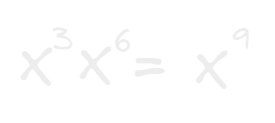
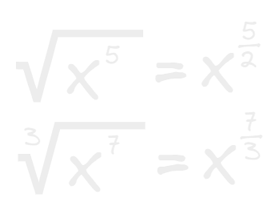

- 1. algo a la 0 siempre dará 1 extraño no?
  
- 2. si se están multiplicando expresiones con potencias que comparten la misma base, los exponentes simplemente se pueden sumar:
  
  Al igual que pasa en muchas otras características de la matemática donde pareciera que todo se refleja en un espejo y tiene su lado opuesto.
  Si hay una division de potencias que comparten las misma base sus exponentes se pueden restar sencillamente.
  
  Es bastante común ver respuesta convertidas a esta anotación cuando el exponente termina siendo negativo, en donde se convierte a una fracción con numerador de 1 y con nuestro resultado como denominador pero con valor positivo en su exponente.
  Porque esto es así? me gastaría averiguarlo.
  
- 3.Si el exponente en el resultado da 1 se puede omitir.
  
- 4.Cuando estamos haciendo una potenciación de una potencia podemos simplemente multiplicar sus exponentes. 
  
- 5. Parece ser que en el algebra (no se en otras areas) existe algo llamado radicación la cual consiste en convertir una raíz cuadrada en su equivalencia en potencia para hacernos la vida mas fácil.
  El algoritmo para lograr esto es bastante sencillo, dejamos la base tal cual, y nuestro exponente se volverá una fracción en la cual el numerador sera nuestro antiguo exponente y el denominador sera el radical de la raíz cuadrada.
  #Recuerda que el radical por default de una raíz es lo que se conoce como una raíz cuadrada ósea 2
- 
  Esto serial igual a la inversa, donde el numerador se convertirá en el exponente de nuestra base en la raíz y el denominador en el radical de la raíz.
  