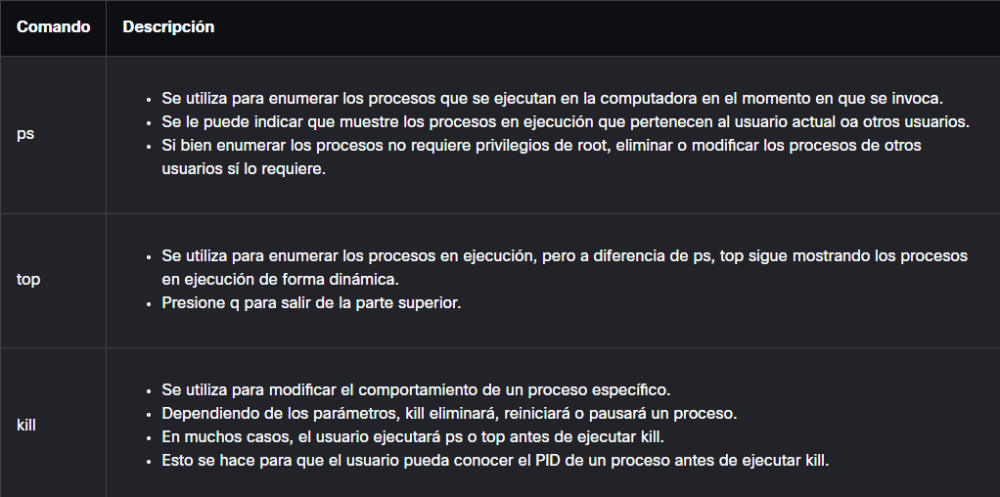

- Hay linux el sabroso mundo de la libertad, seguramente ya has estado en contacto con linux antes de una u otra manera.
- En Linux todo es un archivo, el propio sistema y sus configuraciones están en archivos que se pueden modificar fácilmente eso si, si no le tienes miedo a quedarte sin PC jaja, hasta para mostrar texto en la pantalla de la terminal Linux modifica el archivo encargado de mostrar cosas en el terminal.
- Los archivos de Linux cuentan con una informacion básica que te ayuda a entender rápidamente con que estas trabajando.
  
- Como podrás ver hay unas letras extrañas -rw-r--r-- ? what? estas no son letras sin sentido son los famosos  [[Permisos de Archivo]] de Linux.
- Listo ya entendemos los permisos pero que es eso de number of hard links? que es un hard link? para ello veamos los [[Linux Links]]!
- Algo curioso de Linux es que al ser tan versátil se ha convertido en el hogar de la [[CiberSeguridad]] y el perfecto [[OS]] para crear un [[SOC]], de todas las distribuciones de Linux la que se queda con la fresa del pastel es [[Kali Linux]]
- una de las cosas mejores cosas de linux es su terminal con la que puedes hacer cualquier cosa sin ningún tipo de UI, el sentimiento de ser un informático 100% real, todo ello se logra a base de comandos veamos algunos de los mas populares.
- [[Comandos de Linux]]
- Sabias que en linux puedes colocarle un alias a cierto comando para no tener que escribirlo 1 y otra vez?
- ***Linux Alias*** #code
  ```bash
   alias gocode="cd ~/Code_Library"
  # now everytime i write gocode in the console i can go to the code library 
  ```
- en Linux todo suele ser procesos, y cada proceso tiene sus archivos de configuración cuando un proceso inicia agarra estos archivos y configura su comportamiento por ello, al hacer cambios en estos archivos es necesario reiniciar el proceso para que agarre los nuevos cambios. Seguramente en estos archivos veas el omnipresente patrón llave = valor de las ciencias de la computación.
- comandos comunes para la administración de los procesos suelen ser:
  {:height 437, :width 864}
- En Linux a los procesos en segundo plano independientes que no necesitan tener ninguna interacción con el usuario se les conoce como [[Daemons]].
- Como ya explique en la parte de [[Monitorización]] esta es muy importante para la [[CiberSeguridad]] para ellos veamos algunos de los logs mas populares en Linux [[Linux Logs]]
- algo muy importante es cualquier [[OS]] son los [[File Systems]] veamos los principales de Linux [[Linux File Systems]]
- Otra funcionalidad muy útil de Linux es son los [[Pipes]] como ya habrás visto en otros lugares los pipes son como unir algo, crear una linea de producción o una tubería donde el resultado de algo se le pasara a otro programa como parámetro para que haga cosas con este.
- ***Linux Pipe*** #code
  ```bash
  cat /logs | grep 17:00:00 # this command prints logs and pass them to the grep command with the | symbol
  # with that grep filter the result of print by any condition like logs for events at 17:00:00
  ```