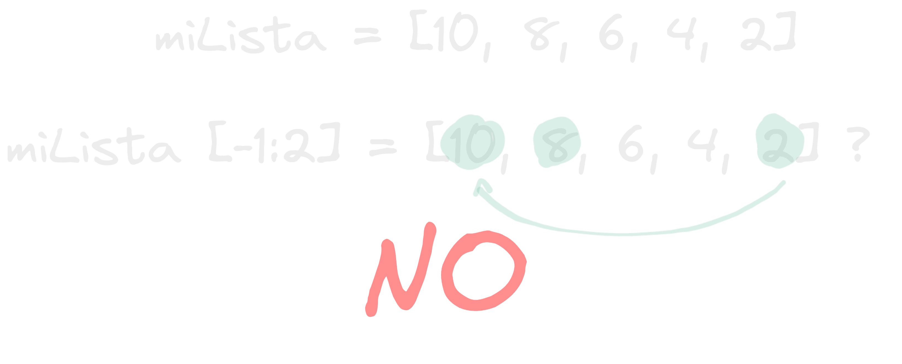

- Las rodajas de las listas son como cortar algo hasta donde hay una pared lista[2:8] solo cortara los elementos de la lista desde el 2 hasta el 7 que es el anterior del limite o (pared) de la rodaja y lo devolverá en una nueva lista, algo curioso es que si el inicio esta después del limite la lista no cortara nada y el resultado sera una sublista vacía. lista[-1:2] no intentara dar la vuelta y seleccionar los elementos desde la pared hasta el inicio.
  
- Si omites el inicio o fin de las rodajas, los valores default como sus nombres lo indican son inicio (0) y final (longitud de la lista) entonces si haces algo como lista2= lista2[:] estarías copiando la lista entera.
- Otro dato curioso es que la asignación normal de una lista a una nueva variable lo que hace es copiar la dirección en memoria de la lista a esa variable y aunque se utilize la instrucción del si queda otro puntero existiendo la lista no se borrara.
- ***funcionamiento de del en diferentes punteros de una misma lista*** #code
  ```python
  lista1 = ["A", "B", "C"]
  lista2 = lista1
  lista3 = lista2
  
  del lista1
  del lista2
  
  print(lista3)
  ```
  el output de esto sera la lista ya que aunque se haya utilizado la instrucción del los que se borraron fueron los punteros en si, más no la lista ya que quedaban otros apuntando hacia ella.
- Las listas también tienen algo bastante llamativo las comprensiones de lista en las cuales una lista se crea desde adentro dándole no un valor, o una lista de valores si no una expresión que definirá los elementos con los cuales se llene la lista.
  ***Lists Comprehensions*** #code
  ```python
  # Lista de 10 multiplos de 2
  multiplosDeDos = [i * 2 for i in range(10)]
  # el codigo dentro de la lista literalmente dice un elemento multiplicado por 2
  # durante 10 iteraciones
  ```
  Esto parece no tener sentido al principio, como voy a meter a una lista algo multiplicado por 2 y luego un loop wtf?, pero eso no es lo que quedara dentro de la lista, lo que quedara dentro de la lista son los valores que a partir de la condición que puse y cuantos elementos serán a partir del loop de dentro, es como decir crea un item con esta condición tantas veces y esos items son los que terminan en la lista.
- estas expresiones pueden ser cualquier cosa como por ejemplo:
  ***filtrado por comprensión de listas*** #code
  ```python
  lista = [1,5,7,"e",2,"A","X",6,9,"j"]
  
  solo_letras = [x for x in lista if type(x) == str]
  #esto colocara los items de la primera lista en la segunda solo si son de tipo string
  ```
- hasta las listas de comprensión pueden ser anidadas como por ejemplo para crear un tablero de ajedrez
  ***chess board with list comprehension*** #code
  ```python
  tablero = [[square for i in range(8)] for j in range(8)]
  ```
  crea una lista de 8 cuadrados 8 veces dentro de otra.