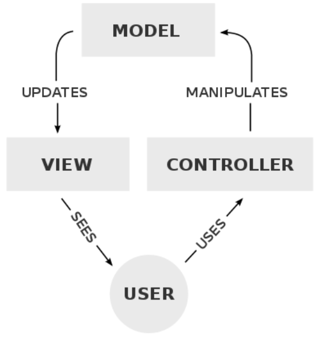

- 
- this is simpler that how it looks.
- the controller is all the strong logic (business logic) of the web app the so called backend
- the model is the persistent data that the app use the so called database
- an the view is interface through that data is showed up to the user the so called frontend