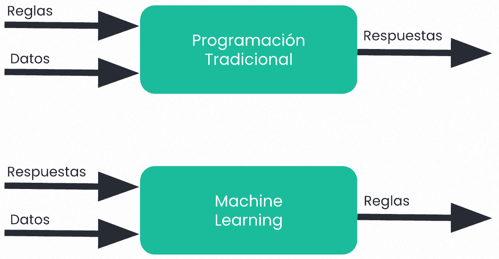

- el hijo de la [[Estadística]] y la [[Computer Science]]
- el proceso por el cual un modelo matemático ejecutado en una computadora aprende de datos y muestras para luego tomar decisiones sobre algo, identificar?, predecir?, categorizar?, si logra aprender a identificar patrones y distinguir cosas al igual que nosotros las posibilidades son demasiado inmensas para cambiar el mundo.
- Matemáticamente puedes pensar en un modelo de Machine Learning  como una [[Función Matemática]] que recibe un numero de variables/features y devuelve un valor. Los diferentes valores que devuelva pueden significar diferentes cosas dependiendo del contexto en el que estés implementando el modelo.
- En contraste con la programación tradicional donde le damos a la computadora un manual de instrucciones con pasos precisos para resolver algo que queremos, aquí se podría decir que ella aprende por su cuenta y encuentra ese manual por ella misma según los datos y los resultados que esperamos después de procesar esos datos.
  collapsed:: true
	- 
- Hay 2 tipos principales de Machine Learning [[Supervisados]] y [[No Supervisados]] la principal diferencia entre estos es la necesidad de definir valores de salida específicos.
- Un proceso básico para el desarrollo de un modelo de machine learning.
	- 1. Recolectar o conseguir datos
	- 2. Identificar y entender el problema que quieres solucionar.
	- 3. Explorar tus datos [[EDA]] para ver que inferencias o ideas puedes encontrar a primera vistas.
	- 4. Definir por que métricas vas a cuantificar el buen desempeño de tu modelo.
	- 5. Dividir tu Dataset en 3 grupos:
		- 1.Grupo de entrenamiento
		- 2.Grupo de evaluación
		- 3.Grupo de testeo
	- 6.Hacer [[Feature Engineering]]
- Pero que hay mas abajo del machine learning? si exacto nos adentramos al mundo del [[Deep Learning]]