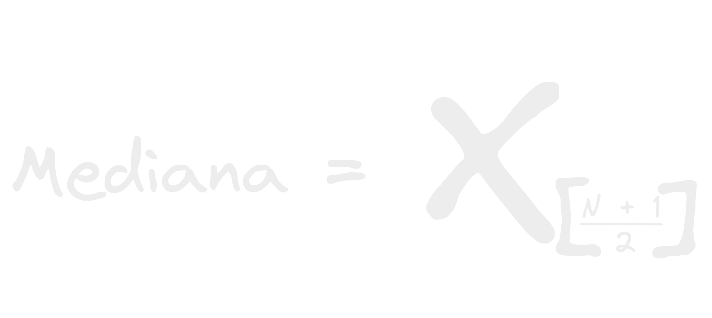
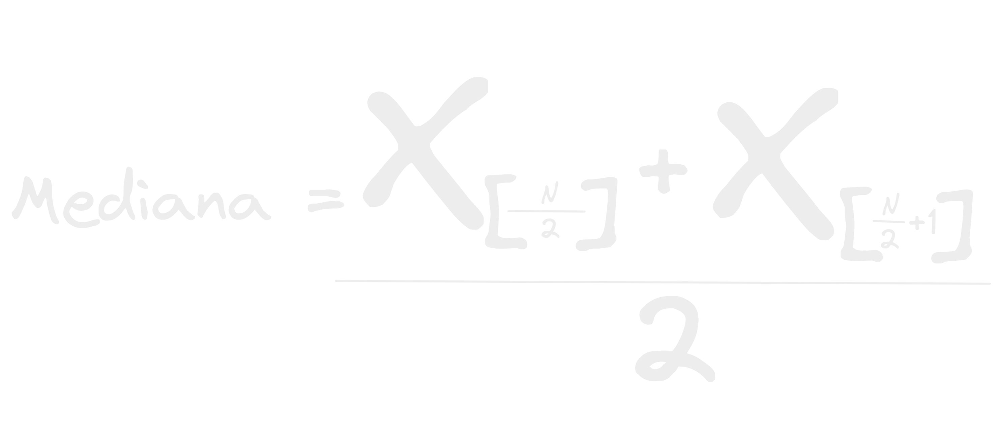

- La mediana es simplemente el elemento/valor que esta en el medio de un conjunto.
- Parece ser que la propia definición y para que la mediana tome sentido en un conjunto datos es que tiene que ser el valor en el cual una mitad de las observaciones estén por debajo de el y la otra por encima de el, por lo tanto solo se cumple si los datos están ordenados, o si no habrían observaciones/elementos mayores o menores a la media en partes en las que no deberían y ya esta no representaría la mitad de los datos no por posición sino por valor!
	- summary
		- Parece ser que la propia definición y para que la mediana tome sentido en un conjunto datos es que tiene que ser el valor en el cual una mitad de las observaciones estén por debajo de el y la otra por encima de el, por lo tanto solo se cumple si los datos están ordenados, o si no habrían observaciones/elementos mayores o menores a la media en partes en las que no deberían y ya esta no representaría la mitad de los datos no por posición sino por valor!
- Ya que si lo piensas bien al ordenar los datos el valor se convierte en posición, si es de mayor a menor sabras que el 7 esta antes del 2 en la sucesión o conjunto de datos y si es de menor a mayor,  estarás seguro que mas a la derecha seguro esta el 124 que el 50.
- dependiendo si el conjunto tiene un total de elementos par o impar las formulas para calcular la mediana varían.
- Impar:
  
  La mediana de un conjunto impar siempre sera el numero que este en la posición de la longitud del conjunto  + 1 dividido en 2.
- Par:
  
- Como vez aquí es un poco mas complicado ya que el conjunto al tener una cantidad de elementos par la mitad real estaría entre los 2 números que están en el centro, por eso es que la mediana de un conjunto par sera siempre el elemento en la posición de la longitud del conjunto dividida en 2 + el elemento en la posición de la longitud el conjunto dividida en 2 mas 1, y esta suma dividida en 2, precisamente para sacar la mitad o como un [[Promedio]] entre los 2 números del medio del conjunto.