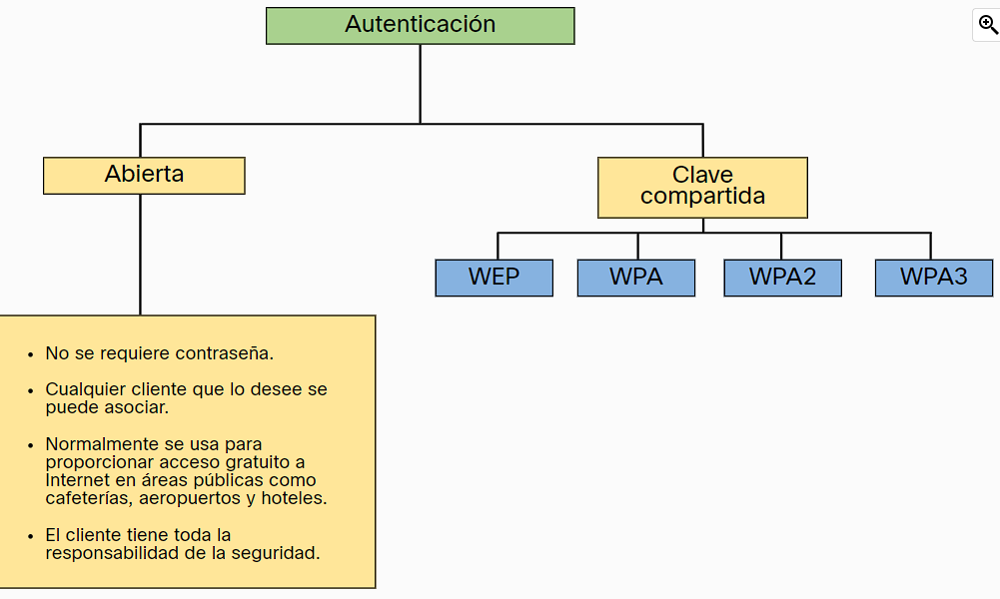

- Ocultado del punto del [[AP]] utilizando un modo activo en vez de pasivo.
- Filtrado de direcciones [[MAC]] para dar acceso solo a direcciones MAC especificas en vez de a todo el mundo.
- Autenticación tanto de sistema abierto (utilizado comúnmente en redes que ofrecen libre acceso a internet a cualquiera) como con autenticación de llave compartida la cual cuenta con varios protocolos diferentes que han evolucionado con el tiempo:
  
- Normalmente la mejor opción hoy en día es una autenticación tipo [[WPA2]]