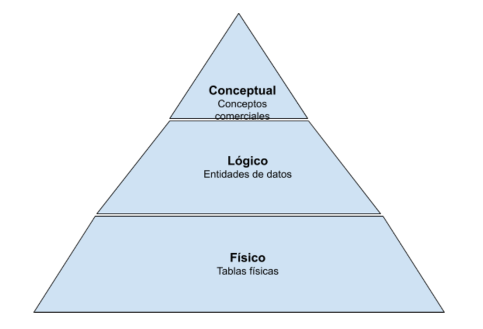

- Esto no es mas que un diagrama que representa visualmente como se ordenan, estructuran y la relación entre los datos de un Dataset talvez esto te recuerde a los diagramas de flujo de una pagina web, o los diagramas relacionales de una base de datos, básicamente como el plano de una casa.
- Estos pueden ser tan sencillos o detallados como se requieran, lo que lleva a 3 niveles:
  
- Como puedes ver esto se parece al nivel de complejidad de los [[Programming Languages]] o de la programación en general entre mas profundo mas detallado y técnico se hará el modelo, pero entre mas arriba mas simple y mas abstracción habrá para que el modelo sea mas fácil de entender.