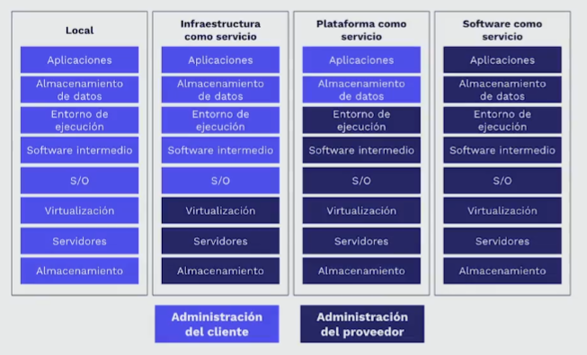

- Estos se pueden ver como diferentes capas o niveles en donde vamos delegando trabajo al proveedor de la nube para hacer las cosas mas rápido.
  
- Imagina que estás construyendo una casa desde cero. IaaS, o "Infraestructura como Servicio", sería como comprar los materiales de construcción, herramientas y maquinaria necesarios para construir tu casa. En este caso, tú tendrías que construir todo desde cero, desde los cimientos hasta el techo, incluyendo la instalación eléctrica, la fontanería, la carpintería, etc. En términos de la nube, IaaS te proporciona la infraestructura básica, como servidores, almacenamiento y redes, pero tú tendrías que instalar y configurar todo el software y aplicaciones necesarias para ejecutar tu aplicación.
- PaaS, o "Plataforma como Servicio", sería como contratar a un equipo de construcción que te proporciona una estructura básica de la casa, incluyendo los cimientos, paredes y techo. A partir de aquí, tú podrías personalizar el interior de la casa a tu gusto, como pintar las paredes, instalar los muebles y decoraciones, etc. En términos de la nube, PaaS te proporciona una plataforma básica, como un sistema operativo, una base de datos y un servidor web, pero tú tendrías que desarrollar y configurar tus propias aplicaciones y personalizarlas según tus necesidades.
- Finalmente, SaaS, o "Software como Servicio", sería como comprar una casa ya construida y completamente equipada, lista para entrar a vivir. En este caso, no tendrías que preocuparte por la construcción ni por la instalación de las diferentes partes de la casa, sino simplemente por hacer uso de ella. En términos de la nube, SaaS te proporciona una aplicación completa y lista para usar, como un programa de correo electrónico, una plataforma de gestión de proyectos o una herramienta de videoconferencia, que puedes utilizar directamente sin necesidad de instalar ni configurar nada.
- En resumen, IaaS es como construir tu propia casa desde cero, PaaS es como personalizar una casa preconstruida y SaaS es como comprar una casa lista para usar.
- Por ultimo estaría el primo extraño de la familia, el serverless o "función como servicio" que seria como contratar un equipo de super constructores que cuando lo necesites construirán una casa como la definiste para que la uses y al terminar esa casa se demolerá para que quede el espacio disponible para alguien más, y así sucesivamente. En términos de nube es como que el proveedor de provee de todo lo que necesites para ejecutar un código en particular en un momento dado, como un registro de usuario o un click a un botón en ese momento el código que hayas definido se monta en sus servidores se ejecuta hace su trabajo y pam! se acabo, se suele utilizar para procesos simples y funcionan a través de funciones que son disparadas por eventos.