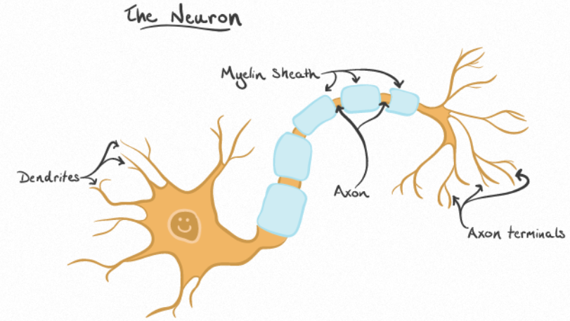
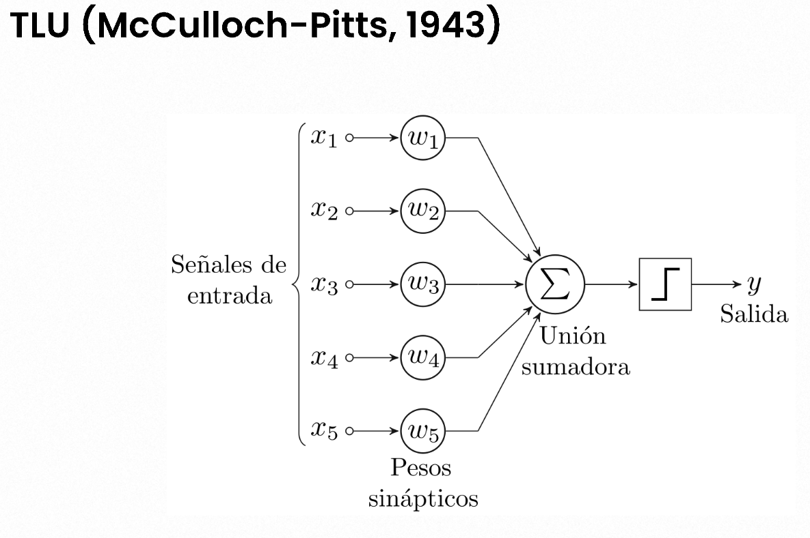

- una [[Neurona]] es la célula principal del cerebro, se podría decir que la combinación e interconnexion entre estas son lo que nos hace ser nosotros.
- 
- Cada una de estas recibe información que a través de las dendritas la procesa y esa información cambiada, transformada, aumentada o reducida en el núcleo se transmite a las siguientes a través de las terminales del axon y las siguientes hacen lo mismo y así sucesivamente a traves de millones de neuronas, ese proceso es lo que nos hace llegar a ser nosotros?, la clave de que la humanidad haya conquistado el mundo?
- Como podrás inferir puede que la información no llegue en un solo paquete si no puede llegar en varios pedazos por cada dendrita, pero acaso cada pedazo de información tiene las misma importancia?
- Imagina que tus neuronas quieren saber que estas mirando, y a tu cerebro llega información de lo que estas viendo, de lo que estas oliendo, de lo que estas escuchando y esa información a su vez se divide en color, formas, distancia, intensidad del olor, ondas sonaras particulares nose nuestro cerebro seguramente puede dividir los estímulos que recibimos del exterior en muchas cosas con todo esa información se inicia el proceso de que entiendas que estas viendo, pero puede que tus neuronas vean que unos pedazos de información son mas importantes que otros para llegar a una conclusion, si estas intentando identificar algo puede que sea mas valioso su color y forma que su olor, por lo tanto la neurona seguro tomara en cuenta mas estos primeros datos en el procesamiento lo que ya cambia muchas cosas, una neurona no es una batidora donde echamos cantidades iguales de diferentes pintura para que salga el color que queramos, si no donde echamos cantidades diferentes de diferentes pinturas según el color que queramos que salga!.
- Viendo esto una de las primeras neuronas artificiales fue la TLU
	- 
	- una [[Función Matemática]] la cual recibe diferentes datos, esos datos se multiplican por un valor que es su peso/importancia en el procesamiento y luego todo ello se suma para unificar la información en un solo valor, y este valor al final se compara con un umbral para saber si es mayor o no a 0 este ultimo paso se podría considerar una [[Función de Activación]].
	- Como podrás los científicos de esa época estaban recreando bastante bien el comportamiento de las neuronas pero esa ultima parte estaba deteniendo el avance, ya que solo nos permitía obtener un tipo de dato como output 0 o 1, true or false, si o no, era como decir después de recolectar estos datos, asignarles su importancia, procesarlos, unificarlos, esto es si o es no?
	- Como un ejemplo vuelve a pensar que queremos identificar algo, hacemos todo el proceso y al final las nosotros y las neuronas se preguntas esto es un perro?, la respuesta solo podría ser si o no, imagina ese mundo donde solo pudiéramos pensar así?, al final te podrías quedar con que eso no es un perro pero tampoco sabes que es o a que se parece.
	- Estas limitaciones llevaron a que se investigaran y se crearan funciones de activación mas complejas que pudieran devolver mas información como la función [[Sigmoide]]!.
- Una de las siguientes neuronas que fue una revolución fue el [[Perceptron]]