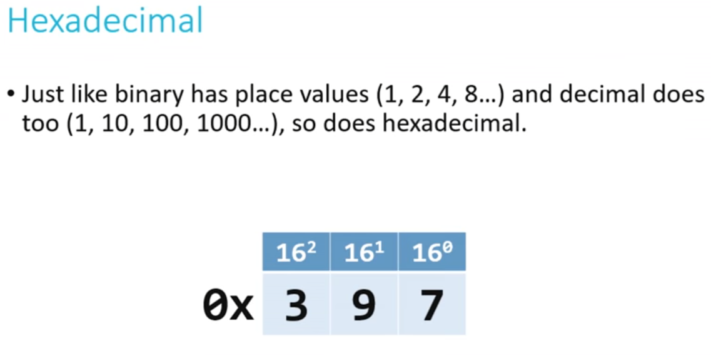

- ## There are lots of notational systems like which ones? #card #computer_science
  card-last-interval:: 4
  card-repeats:: 2
  card-ease-factor:: 2.7
  card-next-schedule:: 2022-03-08T20:43:26.631Z
  card-last-reviewed:: 2022-03-04T20:43:26.632Z
  card-last-score:: 5
  collapsed:: true
	- Binary  
	  Hexadecimal  
	  Decimal(ordinary life system)
- So how exactly those systems works? #computer_science
  collapsed:: true
	- so essentially notational systems or base systems means the number of digits that you have in your power to count or represent information. what this means?
	- for example if you can use the decimal system - base 10 a.k.a  (what you learnt in school) you have 10 digits available to count and represent every number that you want.
	- 0 1 2 3 4 5 6 7 8 9
	- if you reach the limit of the digits you only add 1 to the left representing that you have a certain quantity of the previous places full.
	- so you can see this like a table expanding every time you need more space by the power of the base(number of digits that the system has) you can see this more clearly in this hexadecimal example:
	- 
		- int the first column (right to left) you have 7 with a limit of 16, in the second one you have 9 times the limit of the previous one like 9 times 16, and in the last one you 3 times the limit of the previous one, how many is that? so in the second one you have a limit of 16 and every digit represent the limit of the first one so you can have a limit of 16 times 16 that is equals to 256 so the third column are representing 3 times 256.