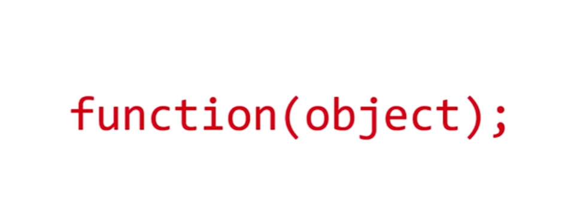
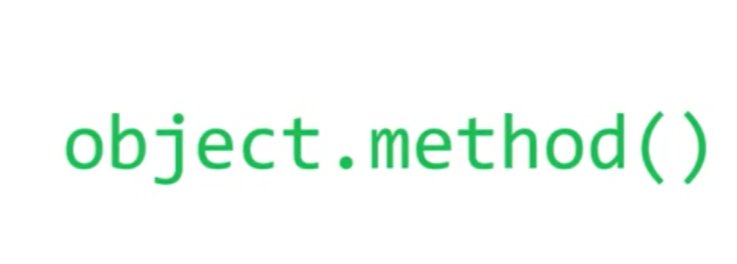

- This literally means that the object is the most important and the main thing that you have while building a software.
- In OOP you don't pass and object to a function to do something with that object
collapsed:: true
	- 
	-
- In OOP you call a function (method) from the object to make that function do something to the object
	- 
- Objects need classes that are like the templates from where we can make unlimited objects with the same characteristics or functions.
- For example in [[Python]] we have to define a class with (__init__) that is a [[Constructor]] that literally put certain values in the object properties (object variables) because in [[Python]] you initialized variables  only when you assign any value to them.