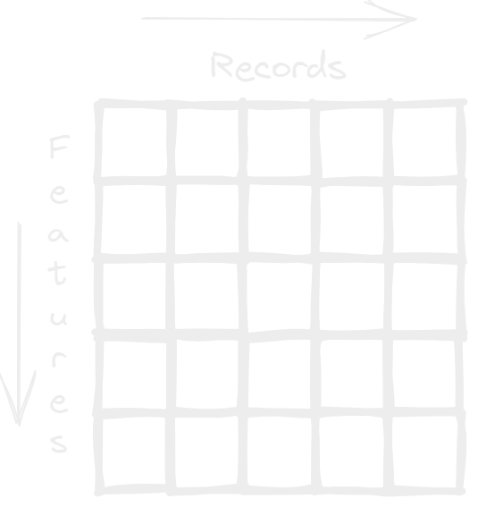

- Las pivot Columns hace referencia a ordenar nuestros datos de forma vertical, que quiere decir esto?, esto quiere decir que cada valor único de nuestros récords/ registros se volverán columnas o features, básicamente hacer una [[Transpose]], como podrás imaginarte esto ocasionara innumerables columnas si los datos que estamos manejando son [[Numéricos]], lo que podría no ser muy adecuado para su lectura o hasta ocasionar un error en la spreadsheet.
- 
- este tipo de estructura no es muy utilizado y seguramente lo utilices en menor cantidad, por ahora lo único que se me ocurre es querer convertir los registros de una variable de tipo [[Categóricos]] que no tenga muchos datos distintos y hacer ciertas operaciones sobre estos como contar cuantos registros tienen cierto categoría como un group by.