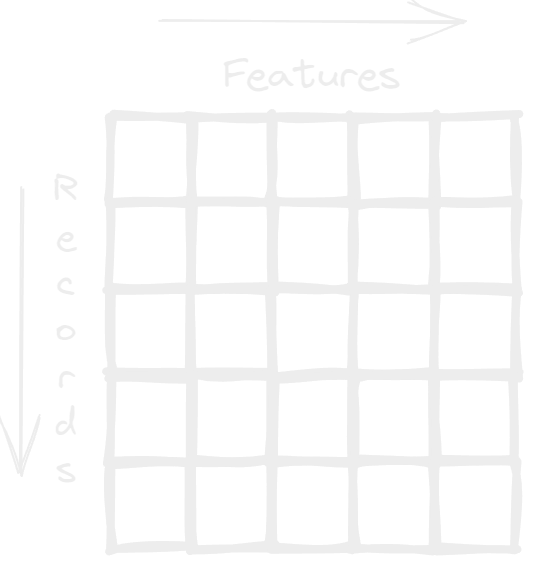

- las rows o filas en una pivot table hace referencia a ordenar nuestros datos horizontalmente, que quiere decir esto que los registros / récords irán de forma vertical mientras las características / features estarán de forma horizontal.
  
- como puedes ver esta es la estructura tradicional de un dataset, y seguramente la que utilices mas.