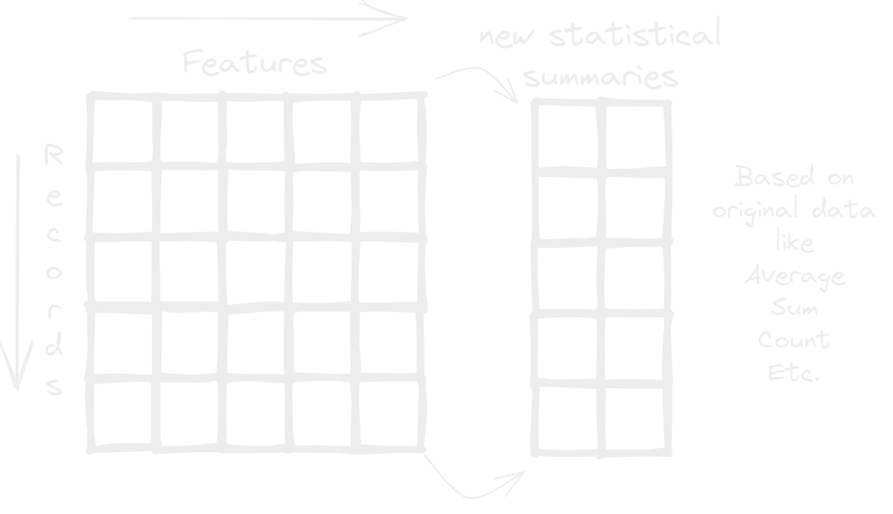

- Hasta ahora con las opciones de [[Pivot Rows]] y [[Pivot Columns]] pensaras que las pivot tables so sirven para reorganizar los datos de distintas maneras no? pero aqui es cuando las cosas se empiezan a poner mas chidas.
- los pivot values lo que hacen es crear nuevas filas o columnas dependiendo de la estructura que hayamos escogido y estas conteniendo valores creados a partir de los datos originales como??!, estos valores no son mas que los [[Estadísticos Descriptivos]] que tanto utilizas al día a día como el promedio.
- 
- Con esto podemos agregar fácilmente a nuestra tabla [[Estadísticos Descriptivos]] que nos permitirán obtener nuevos valores que nos resumen y nos dan valiosa información a cerca de nuestros datos