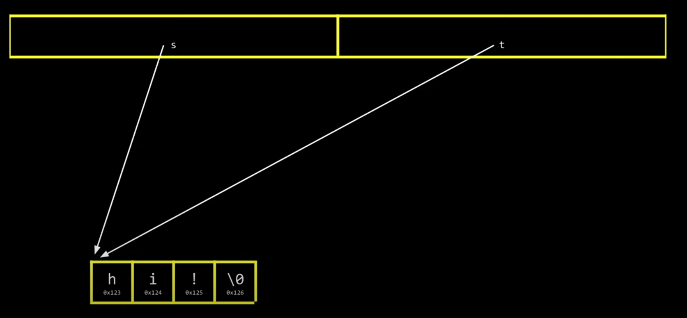
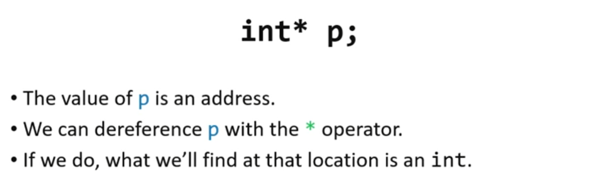

- Pointers are simply the address of the byte where our variables starts
- If you copy an string in #C it's literally a pointer and if you copy a pointer and make a change in one variable it will be applied to the original one because they are arrows that are pointing to the same data.
  collapsed:: true
	- 
- you can find the size of anything with sizeof() function #C
- you can define a pointer in #C with data type + * + name ( int *pointer) , the type define what is the data type store at the address that pointer is pointing.
- you can use dereferencing with * to access to the data store in a pointer and not the address itself 
  (*pointer = "hello") you are changing the value at the pointer address, (pointer = "hello") you are changing the address itself store in the variable an it will cause a terrible error!
- 