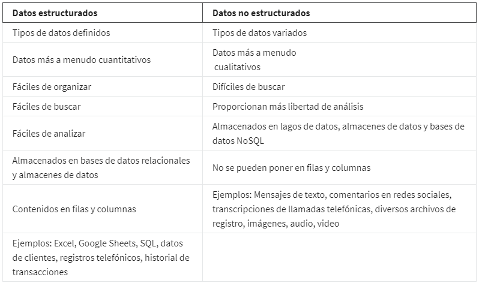
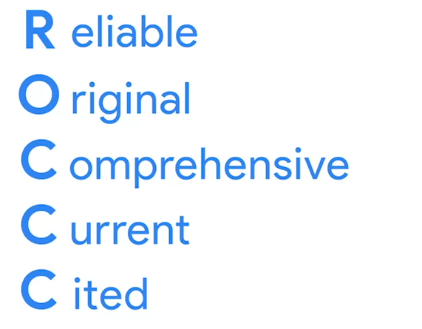

- Llego la hora de recopilar datos!
- ya he hablado de que si lo piensas detenidamente el mundo son datos, puedes sacar datos de cualquier cosa o evento pero como se recopilan esos datos? vamos a verlo.
- Desde encuestas, pasando por entrevistas y llegando hasta observaciones todo genera data.
- Pero si todo genera data significa que toda la data es igual? no, hay diferentes tipos de datos dependiendo de su contexto y la interpretación que les estemos dando.
- Al momento de recoger datos nos encontramos con 2 rutas principales las cuales podrían juntarse en algún proyecto especifico, pero que comúnmente es una u otra, puedes utilizar este diagrama como referencia para iniciar la recopilación de datos en incontables proyectos:
  
- El primer paso es seleccionar el tipo dato correcto pero cuales son estos [[Tipos de Datos]]?
- También como podrás ver el diagrama de arriba hace referencia a elegir [[Fuentes de datos]] pero cuales son estas fuentes?
- ya teniendo en cuenta los tipos de datos y las fuentes datos durante tus desafíos como analista de datos seguramente de encontraras con otras 2 categorías que nacen dependiendo de como están organizados los datos estos son los [[Datos Estructurados]] y los [[Datos No Estructurados]] aqui puedes ver una tabla rápida para ver sus principales diferencias:
  
- teniendo el control sobre todo esto que sigue? lo que sigue es una parte bastante crucial y es confirmar que nuestros datos no tienen ningún tipo de [[Sesgo]], antes de entrar a los datos pensaba que los reportes estadísticos que mostraban en la televisión eran totalmente verdad ya que eran hechos como podrían no ser verdad?, pero después de aprender mas sobre [[Estadística]] y datos en general me di cuenta lo fácil que es caer en sesgos, o lo fácil que es malinterpretar unos datos, o lo fácil que es interprétalos para cierto beneficios, algo que parecía totalmente objetivo se vuelve totalmente subjetivo ya que los datos no no están hablando a nosotros directamente le están hablando al analista de datos que luego nos contara la historia según su interpretación en ese momento en ese paso intermedio pueden pasar muchas cosas.
- También es importante escoger buenas fuentes de datos para escoger una buena fuente puedes utilizar ROCCC:
  
  Entre mas cosas cumpla de este acrónimo mas seguro podrás estar de la fuente y su credibilidad.
- Después de tener los recopilados siguen los [[Data Ethics]]
- Siempre es bueno que los datos que recopilemos tengan [[Contexto]] y una gran forma de hacer esto es agregándoles [[Meta Datos]]