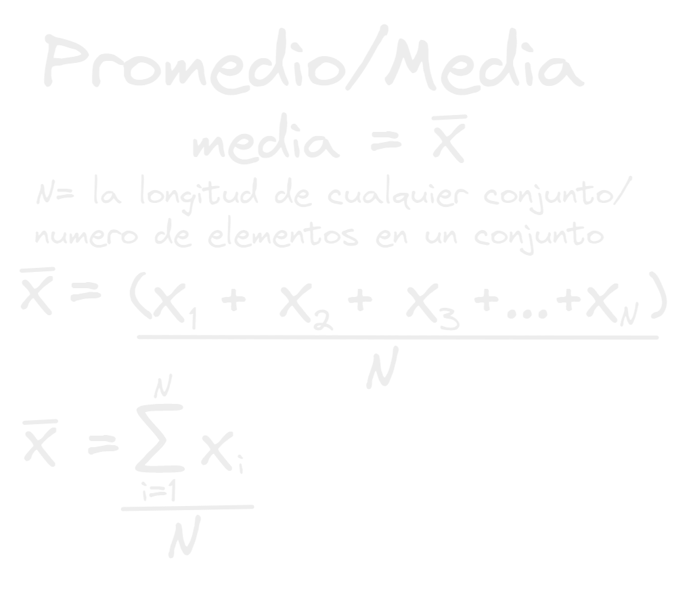

- Ah! el promedio también conocido como la media aritmética aquel que representa que podemos esperar de un conjunto de datos.
- Por ejemplo si nos dicen que el promedio de edad de una clase es de 10 años, nos podemos esperar seguramente que en esa clase habrán niños de 7 años o hasta 12 años o cercano a esas cantidades y podemos descartar que hayan niños de 1 año o de 45 años aunque ya no serian niños jajaja.
- Este estadístico/medida como ves es increíble para resumir grandes volúmenes de datos en solo un valor para ver que podemos esperar de esos datos, pero como todo tiene su parte negativa!
- si hay uno o varios datos atípicos o muy dispares a la mayoría, puede influenciar bastante al promedio y darnos una interpretación errónea de los datos
- ***Promedio de edad de una clase*** #code
  ```python
  clase = np.array([7,8,9,7,6,12,11,10,10,9])
  clase.mean()#8.9
  ```
- Como ves arriba tenemos la edad de cada uno de los estudiantes en una clase de 10, cuando calculamos el promedio obtenemos el valor de 8.9, lo que nos dice que la edad de cada uno de los estudiantes estará un poco mas abajo o un poco mas arriba de esa cantidad.
- pero que pasa si se nos cuela un dato extraño o muy alejado a los demás en nuestro lista?
- ***Promedio de edad de una clase alterado*** #code
  ```python
  clase = np.array([7,8,9,7,6,12,11,70,10,9])
  clase.mean() #14.9
  ```
- Como ves arriba se nos ha colado un 70 en nuestros datos y esto ha afectado todo el promedio, con este promedio pensaríamos que los estudiantes tienen un poco menos de 15 años o un poco mas de esto, pero no! el único mayor es el 70, de resto ningún estudiante pasa ni siquiera los 13 años, además de eso también con esto promedio nos cuesta pensar que habría alguien con 6 años!.
  Como ves un único dato atípico altero toda la representación que el promedio nos puede dar!
- la formula matemática del promedio es:
  
- Pero oye el primer ejemplo esta muy bien no? se entiende que estamos sumando todos los elementos de nuestro conjunto pero y esa M girada que es eso?! ese es la que parece desafiante pero al final es muy simple [[Sumatoria]] una notación de las [[Matemáticas]]